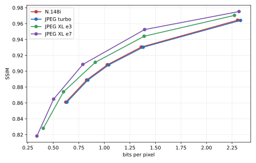
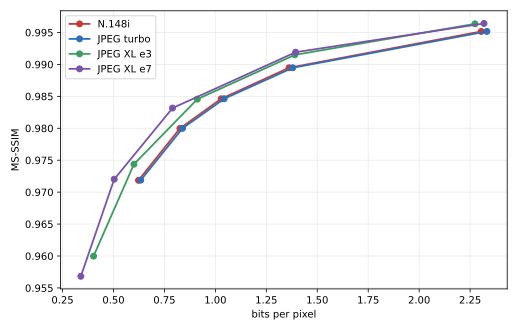

# N.148i — definitive benchmark against JPEG and JPEG XL

N.148 / N.148i — Copyright (c) Micilini Roll, MIT License.

Measurements were collected on September 5–6, 2026, in the
`America/Sao_Paulo` time zone, across 120 images and 20 codec/quality points.
The baseline code was commit `ddd6192fe90ae053477dca0430627f2f44a196d9`;
the benchmark instrumentation is included with this report. No codec core file
was modified.

The public bitstream identifier was finalized as **version 1** after the
measurements. This release-only adjustment changes one fixed header byte; it
does not change the header length, payload, decoded pixels, codec execution
paths, compressed sizes, or timings. The raw benchmark metadata intentionally
retains the hash of the exact binary used for the measurements.

## The result in one sentence

In the single-thread comparison, N.148i beat libjpeg-turbo simultaneously in
rate, encode time, and decode time: it required **1.35% to 1.60% fewer bits at
the same quality**, used **25.84% less encode time (1.349× the throughput)**,
and **6.70% less decode time (1.072× the throughput)**. Against JPEG XL, the
compression result is reversed: N.148i required **12.87% to 71.88% more bits**,
depending on metric and effort, although it was **7.34× to 89.29× faster at
encoding** and **9.97× to 10.79× faster at decoding** on the single-thread
axis.

N.148i parallelism is its clearest weakness: on 10 physical cores, speedup was
only **1.386× for encode** and **1.022× for decode**. The sub-1% noise target
was also met almost entirely on the single-thread axis, but not on the
multi-thread axis. Axis B and the thread sweep must therefore be read with the
statistical caveat documented in the timing section.

## 1. Environment

| Item | Observed value |
|---|---|
| Machine | Dell Inspiron 14 5440 |
| CPU | Intel Core 7 150U, 10 physical cores, 12 logical CPUs |
| CPU set without SMT siblings | `0,2,4,5,6,7,8,9,10,11` |
| Advertised frequency | 400 MHz to 5.4 GHz; frequency not locked |
| Detected ISA | SSE2, SSE4.2, AVX, AVX2, and FMA; no AVX-512F |
| System | Ubuntu 24.04, Linux `7.0.0-28-generic`, x86-64 |
| Compiler | GCC `13.3.0` (`-O2 -pthread`) |
| Power profile | `balanced`; `powersave` governor on all 12 logical CPUs |
| Effective libjpeg linkage | libjpeg-turbo `2.1.5`, `/lib/x86_64-linux-gnu/libjpeg.so.8` |
| Distribution libjxl | `0.7.0`, rejected because it is below the required 0.8 minimum |
| libjxl used | `v0.12.0`, commit `a7a9c787341cf703dede03c2009fa460cae5e5df`, Release/shared |
| Linked JXL libraries | `libjxl.so.0.12`, `libjxl_threads.so.0.12`, and `libjxl_cms.so.0.12` from the local installation |
| Corpus converter | ImageMagick `6.9.12-98 Q16` |
| Python and analysis | Python 3.12.3; NumPy 2.5.2; SciPy 1.18.1; scikit-image 0.26.0; Pillow 12.3.0; sewar 0.4.8; Matplotlib 3.11.1 |

libjxl was built from the official repository because the system package was
too old. The build used `CMAKE_BUILD_TYPE=Release`, `BUILD_SHARED_LIBS=ON`,
`JPEGXL_ENABLE_TOOLS=ON`, `JPEGXL_ENABLE_BENCHMARK=OFF`, and
`JPEGXL_ENABLE_EXAMPLES=OFF`, following the [official v0.12.0
BUILDING.md](https://github.com/libjxl/libjxl/blob/v0.12.0/BUILDING.md). The tag
and release notes are available in the [official v0.12.0
release](https://github.com/libjxl/libjxl/releases/tag/v0.12.0).

`ldd` confirms that `compare` uses `libjpeg.so.8` and that `benchmark-final`
uses the same libjpeg plus the local JXL libraries. The complete capture of
`lscpu`, `uname`, packages, `ldd`, CMake, FFmpeg filters, versions, binary
hashes, and the power profile is in
[`benchmarks/v1/environment.json`](benchmarks/v1/environment.json). The binary that
produced the matrix has SHA-256
`4fde6a2893d7e619837f316285927f0b7bdda568679a53aa6abc567ef59ecbc7`.

## 2. Correctness validation

**Every correctness gate passed before measurement.** The full output is in
[`benchmarks/v1/validation.log`](benchmarks/v1/validation.log).

| Check | Result |
|---|---|
| Sentinel `./compare images/example.ppm 50 20` | PASS; N.148i = **2,290 bytes**, exactly as expected |
| `./validate` | PASS; `validation PASS (0 failures)` |
| Scalar versus AVX2 | PASS; byte-for-byte identical file and identical PSNR |
| Dimensions not divisible by 8 | PASS at 317×241 |
| Chroma modes 0/1/2 | PASS for 4:4:4, 4:2:2, and 4:2:0, without desynchronization |
| One versus four threads | PASS; identical files in every chroma mode |
| Bitstream consumption | PASS; bytes consumed = payload bytes written in every round trip |
| Complete matrix | PASS; 5,400 unique rows, with no missing cell |
| Determinism by thread count over the corpus | PASS; zero bitstream-size divergences across all 120 images |

Within every call, the final driver also validates the header, Huffman tables,
complete container size, exact payload consumption, and reconstructed
dimensions. A failure would stop the matrix instead of producing a row.

## 3. Corpus

The corpus contains **120 distinct 8-bit RGB P6 PPMs**, totaling **53,780,086
pixels**. Each of the eight categories contains 15 images:

| Category | Images | Min. / median / max. pixels |
|---|---:|---:|
| Historical portraits, 2D artworks | 15 | 222,208 / 716,160 / 1,324,800 |
| Natural landscapes | 15 | 174,592 / 426,400 / 565,494 |
| Urban scenes and architecture | 15 | 147,456 / 468,000 / 636,411 |
| High-frequency textures | 15 | 196,608 / 478,400 / 848,241 |
| Smooth surfaces and gradients | 15 | 172,544 / 427,200 / 696,663 |
| Fine detail | 15 | 147,456 / 442,400 / 848,241 |
| Text and sharp edges | 15 | 148,160 / 307,200 / 769,035 |
| Saturated and desaturated colors | 15 | 129,024 / 331,560 / 636,411 |

Widths range from 288 to 1,036 pixels and heights from 252 to 1,600 pixels;
the median image contains 426,800 pixels. The resolution distribution is:

| Range | Images |
|---|---:|
| Fewer than 400,000 pixels | 51 |
| 400,000 to fewer than 700,000 | 57 |
| 700,000 to fewer than 1 million | 7 |
| 1 million or more | 5 |

### Sources and licenses

| Source | Images |
|---|---:|
| Wikimedia Commons | 15 |
| Openverse / Flickr | 102 |
| Openverse / StockSnap | 2 |
| Openverse / Rawpixel | 1 |

| Recorded license | Images |
|---|---:|
| Public domain | 8 |
| CC0 / CC0 1.0 | 25 |
| CC BY 2.0 | 87 |

The corpus has 120 source-page URLs, 120 download URLs, 120 source hashes, and
120 unique PPM hashes. No entry contains a photographed, identifiable person;
items classified as portraits are historical paintings, engravings, or other
2D artworks. Provenance and attribution for every file are recorded in
[`benchmarks/v1/corpus-manifest.json`](benchmarks/v1/corpus-manifest.json) and
[`images/CREDITS.txt`](images/CREDITS.txt). [Openverse describes itself as a
search engine for openly licensed media](https://docs.openverse.org/). Because
an aggregator does not replace legal verification of a work, the manifest also
preserves its page, author, license, license URL, and hash.

Of the source files, 118 were JPEG and two were PNG. To avoid preserving the
source JPEG DCT grid, all 118 JPEGs were spatially resized; the 42 that would
otherwise have retained their dimensions were reduced by 10%, without letting
the short side fall below 320 pixels. This does not remove artifacts already
present in the source and is a stated limitation of this corpus.

Normalization used the first frame, `-auto-orient`, sRGB, downscaling without
upscaling, alpha flattened over white, `-strip`, 8-bit depth, and P6 PPM. The
audit confirmed P6, RGB, 8-bit depth, exact payload length, and no alpha in
every file. The system `convert` command was GraphicsMagick and produced a
different result for `-colorspace sRGB`; the actual ImageMagick 6.9.12-98 was
therefore used, and the final hash was treated as authoritative.

### Committed corpus and reconstruction

All 120 PPM files are intentionally committed under `images/` so reviewers can
audit the exact test data offline. `images/MANIFEST.json` is byte-for-byte
identical to the versioned benchmark manifest, with SHA-256
`d3a16d5a5034b6255e75a99fffdc3652e1cab71bda112fe801944026a927a59f`.
No separate ZIP or tar archive is required or retained.

[`tools/fetch_corpus.py`](tools/fetch_corpus.py) downloads each source, checks
the download hash, repeats the conversion recorded in the manifest, validates
the PPM structure and dimensions, and installs the file only if its final
SHA-256 matches. A broken link, changed source, incompatible converter, or hash
mismatch produces a warning and a nonzero exit status. On this machine, all
120 existing files passed verification; one PNG source and one JPEG source
were also rebuilt from scratch and were byte-for-byte identical.

## 4. Methodology

### Codec configuration

| Codec | Points | Configuration |
|---|---|---|
| N.148i | quality 30, 45, 60, 75, 90 | 4:2:0, optimized Huffman, complete container, runtime SIMD dispatch |
| libjpeg-turbo | quality 30, 45, 60, 75, 90 | 4:2:0, `optimize_coding=TRUE`, `jpeg_set_quality(..., TRUE)` |
| Fast JPEG XL | distance 8, 5, 3, 1.5, 0.7 | effort 3, 8-bit sRGB, lossy mode through the C API |
| Default JPEG XL | distance 8, 5, 3, 1.5, 0.7 | effort 7, 8-bit sRGB, lossy mode through the C API |

The five JXL points were chosen to cover the same observed quality range as
N.148i/JPEG, not because their nominal values are equivalent. For example,
JXL effort 3 covered 28.23–38.20 dB in RGB PSNR while N.148i covered
28.72–36.59 dB. Every size comparison uses the curves' actual intersection,
never the nominal quality number.

The new [`src/benchmark_final_cli.c`](src/benchmark_final_cli.c) calls N.148i,
libjpeg-turbo, and libjxl directly within the same process. Each PPM is loaded
before the timed region; writing, disk reads, process creation, and metric
calculation remain outside it. Measurement includes the codec API's complete
operation, including context creation/destruction, allocations, table
optimization, and bitstream serialization; it does not measure an incomplete
internal shortcut.

### CPU axes

| Axis | N.148i | JPEG | JPEG XL | Affinity |
|---|---:|---:|---:|---|
| A, efficiency | 1 thread | 1 thread | caller, runner with 0 workers | CPU 0 |
| B, throughput | 10 total threads | 1 thread | runner with 10 workers | 10 physical cores, no SMT siblings |
| N.148i sweep | 1, 2, 4, 8, and 10 threads | — | — | first N physical cores |

On axis B, JPEG remains single-threaded per image and pinned to CPU 0. The JXL
runner was explicitly configured with 10 workers and confined to the 10-core
CPU set. The N.148i sweep uses quality 60 over the complete corpus.

### Timing, interleaving, and noise

Each sample aggregates enough internal calls to last approximately 20 ms.
Three warm-up samples were discarded, and the median of the remaining samples
was used. The order of the four codecs rotates on every replicate; encode and
decode traverse opposite orders. The five points also rotate by image. This
distributes frequency and temperature drift among the competitors.

Every raw row preserves the median, mean, standard deviation, IQR, MAD,
coefficient of variation, and the robust uncertainty below, separately for
encode and decode.

The uncertainty used to decide whether to run more replicates was the robust
relative standard error of the median:

```text
100 × 1.253314 × 1.4826 × MAD / (median × √n)
```

Series began with 15 replicates and increased through `2^k-1` steps up to 255
on axis A. Observed result:

| Axis | Rows | ≤1% | Above 1% | Median noise | p95 | Maximum | Replicates |
|---|---:|---:|---:|---:|---:|---:|---:|
| A, single-thread | 2,400 | 2,384 | 16 | 0.319% | 0.845% | 3.419% | 15–255 |
| B, throughput | 2,400 | 38 | 2,362 | 3.040% | 5.847% | 9.005% | 31–255 |
| Thread sweep | 600 | 330 | 270 | 0.947% | 2.553% | 4.916% | 15–31 |

The sub-1% noise requirement was therefore met on **99.33% of axis A**, but
not on axis B. Multi-thread pilots remained between approximately 1.5% and
2.8% even with 255 replicates. After ordinal point 613, the cap for these two
axes was set to 31 to avoid extending the run by more than a day without
convergence. Residuals were preserved, not hidden. Axis A is consequently the
strongest performance conclusion; axis B and scalability are indicative
evidence that deserves replication on an isolated machine with locked
frequency.

During the run, an unrelated task saturated the disk and interrupted the
process. Atomic checkpoints prevented partial rows, and measurement resumed
only after the machine became idle. An initial resume-key defect represented
seven JPEG points as though they had 10 threads. Deduplication removed seven
summaries and 217 duplicate samples using the deterministic rule “highest
replicate count; first original numbered sample,” never measured time. Both
events, every command actually run, and every protocol refinement are recorded
in [`benchmarks/v1/benchmark-metadata.json`](benchmarks/v1/benchmark-metadata.json).

### Quality and statistics

The analysis calculated RGB PSNR, Y (luma) PSNR, SSIM, MS-SSIM,
SSIMULACRA2, and Butteraugli. SSIMULACRA2 and Butteraugli came from tools built
with the same libjxl v0.12.0; the implementation can be audited in the
[official SSIMULACRA2
source](https://github.com/libjxl/libjxl/blob/v0.12.0/tools/ssimulacra2.cc).
VMAF was unavailable because the installed FFmpeg exposes `vmafmotion`, but
not the `libvmaf` filter.

BD-rate was calculated in log(rate) space with PCHIP, using only Pareto points
and the common quality interval, with no extrapolation. For Butteraugli, where
lower is better, the quality sign was inverted before integration. This is a
numerically more stable variant of Bjøntegaard's original measure; the
historical definition is in [Bjøntegaard's VCEG-M33
document](https://eclass.uoa.gr/modules/document/file.php/D221/%CE%A3%CE%B7%CE%BC%CE%B5%CE%B9%CF%8E%CF%83%CE%B5%CE%B9%CF%82/VCEG-M33%20%28Bjontegaard%20Delta%29.pdf),
and modern implementation pitfalls are discussed in this [BD-rate
tutorial](https://arxiv.org/abs/2401.04039).

Aggregate curves use whole-corpus bpp, PSNR derived from pixel-weighted
combined MSE, and pixel-weighted means for the other metrics. Per-image BD-rate
was also calculated. Win/tie/loss uses a ±1% tolerance. Significance uses the
two-sided paired Wilcoxon signed-rank test; differences among categories use
Kruskal–Wallis. A p-value indicates incompatibility with no difference, not
effect size.

The final matrix contains **5,400 unique summaries** and **197,440 individual
samples**. CSV values are stored without rounding.

## 5. Compression results: BD-rate

A negative sign favors N.148i; a positive sign means it needs more bits than
the competitor at the same quality. `W/T/L` means per-image N.148i wins, ties,
and losses, using ±1%.

### N.148i versus libjpeg-turbo

| Metric | Aggregate BD-rate | Per-image median [Q1; Q3] | W/T/L | Wilcoxon p |
|---|---:|---:|---:|---:|
| RGB PSNR | **-1.384%** | -1.588% [-2.235; -1.173] | 96/24/0 | 1.97e-21 |
| Y PSNR | **-1.325%** | -1.478% [-2.011; -1.072] | 96/24/0 | 1.97e-21 |
| SSIM | **-1.599%** | -1.820% [-2.852; -1.159] | 98/22/0 | 2.60e-21 |
| MS-SSIM | **-1.403%** | -1.619% [-2.391; -1.127] | 99/21/0 | 1.97e-21 |
| SSIMULACRA2 | **-1.390%** | -1.520% [-2.293; -1.144] | 94/26/0 | 1.97e-21 |
| Butteraugli | **-1.355%** | -1.509% [-2.692; -0.609] | 76/35/9 | 3.33e-13 |

The aggregate gain is small, consistent, and statistically strong across all
six metrics. The perceptual case is not uniform: Butteraugli finds nine
per-image losses that PSNR/SSIM conceal.

### N.148i versus JPEG XL

| Metric | JXL e3: BD-rate / W-T-L | JXL e7: BD-rate / W-T-L |
|---|---:|---:|
| RGB PSNR | **+34.586%** / 6-2-111* | **+38.594%** / 4-0-116 |
| Y PSNR | **+41.963%** / 8-0-112 | **+40.982%** / 4-0-116 |
| SSIM | **+17.803%** / 8-0-111* | **+31.716%** / 2-0-118 |
| MS-SSIM | **+12.868%** / 8-1-111 | **+20.697%** / 9-1-110 |
| SSIMULACRA2 | **+30.183%** / 0-0-120 | **+41.517%** / 0-0-120 |
| Butteraugli | **+64.079%** / 0-0-119* | **+71.880%** / 0-0-120 |

`*` One per-image curve did not have three Pareto points and sufficient
overlap: image 88 for RGB PSNR/SSIM against e3 and image 90 for Butteraugli.
It was marked missing, not extrapolated. P-values against e3 ranged from
1.97e-21 to 4.63e-19; against e7, from 1.97e-21 to 6.56e-20.

JPEG XL wins unambiguously in compression efficiency. The size of N.148i's
loss depends heavily on the metric: 12.87% for MS-SSIM against e3, but 64.08%
for Butteraugli; against e7, 20.70% and 71.88%, respectively. No honest metric
turns this aggregate result into an N.148i win.

## 6. Quality results and rate–distortion curves

This table is the aggregate corpus curve. Lower Butteraugli is better; higher
is better for every other metric.

| Codec / point | bpp | RGB PSNR | Y PSNR | SSIM | MS-SSIM | SSIMULACRA2 | Butteraugli |
|---|---:|---:|---:|---:|---:|---:|---:|
| N.148i q30 | 0.623 | 28.725 | 30.048 | 0.8610 | 0.97185 | 47.915 | 5.486 |
| N.148i q45 | 0.826 | 30.006 | 31.514 | 0.8889 | 0.97997 | 59.639 | 4.721 |
| N.148i q60 | 1.028 | 31.116 | 32.876 | 0.9081 | 0.98461 | 66.461 | 4.117 |
| N.148i q75 | 1.361 | 32.725 | 34.917 | 0.9305 | 0.98947 | 74.256 | 3.347 |
| N.148i q90 | 2.305 | 36.590 | 40.649 | 0.9644 | 0.99516 | 84.608 | 2.056 |
| JPEG q30 | 0.634 | 28.729 | 30.049 | 0.8611 | 0.97188 | 47.969 | 5.471 |
| JPEG q45 | 0.839 | 30.007 | 31.515 | 0.8888 | 0.97999 | 59.717 | 4.737 |
| JPEG q60 | 1.043 | 31.116 | 32.878 | 0.9080 | 0.98462 | 66.454 | 4.116 |
| JPEG q75 | 1.380 | 32.724 | 34.920 | 0.9303 | 0.98947 | 74.224 | 3.338 |
| JPEG q90 | 2.332 | 36.583 | 40.652 | 0.9641 | 0.99516 | 84.620 | 2.055 |
| JXL e3 d8 | 0.402 | 28.228 | 29.544 | 0.8280 | 0.95998 | 41.962 | 5.765 |
| JXL e3 d5 | 0.600 | 30.043 | 31.787 | 0.8741 | 0.97437 | 57.386 | 4.142 |
| JXL e3 d3 | 0.912 | 32.144 | 34.608 | 0.9113 | 0.98456 | 70.050 | 3.091 |
| JXL e3 d1.5 | 1.390 | 34.756 | 38.438 | 0.9441 | 0.99149 | 80.841 | 2.085 |
| JXL e3 d0.7 | 2.274 | 38.202 | 43.812 | 0.9704 | 0.99635 | 89.025 | 1.193 |
| JXL e7 d8 | 0.340 | 27.580 | 28.527 | 0.8182 | 0.95683 | 39.525 | 6.787 |
| JXL e7 d5 | 0.504 | 29.307 | 30.613 | 0.8649 | 0.97202 | 55.241 | 4.726 |
| JXL e7 d3 | 0.790 | 31.564 | 33.473 | 0.9086 | 0.98316 | 68.636 | 3.232 |
| JXL e7 d1.5 | 1.394 | 34.970 | 38.478 | 0.9526 | 0.99191 | 81.322 | 1.899 |
| JXL e7 d0.7 | 2.318 | 38.336 | 44.031 | 0.9753 | 0.99641 | 89.092 | 1.031 |

Complete values are in
[`benchmarks/v1/analysis/rate-distortion.csv`](benchmarks/v1/analysis/rate-distortion.csv).

### Aggregate curves







Against JPEG, no metric opposed N.148i on 102 of the 120 images: every metric
reported a win or tie, and at least one reported a win. Metrics disagreed on
the other 18. Against JXL e3, 105 images had only N.148i losses or ties, 13 had
metric disagreement, and two were incomplete; against e7, 107 had no metric
opposition to a JXL win, and 13 had disagreements.

The strongest example is `corpus-0107.ppm`, *Color Abstract*: against JXL e3,
RGB PSNR estimates **-40.78%** and SSIM **-27.95%** BD-rate, both favoring
N.148i; SSIMULACRA2 estimates **+69.01%** and Butteraugli **+163.35%**, both
strongly favoring JXL. A hypothesis consistent with the image is that
PSNR/SSIM reward average similarity and smoothing, while perceptual metrics
react to structure and artifacts in saturated transitions. This disagreement
is a result, not a reason to select only the favorable metric.

## 7. Timing results

The percentage below is the geometric mean of all paired N.148i/competitor
ratios over five points, minus one; a negative value means N.148i used less
time. The `×` factors are the inverse time ratio and represent relative
throughput. W/T/L is counted by image after geometrically combining the five
points.

| Axis | Competitor | Operation | N.148i difference | W/T/L | Wilcoxon p |
|---|---|---|---:|---:|---:|
| A | JPEG | encode | **-25.844%** | 120/0/0 | 1.97e-21 |
| A | JPEG | decode | **-6.700%** | 118/2/0 | 1.97e-21 |
| A | JXL e3 | encode | **-86.373%** (7.34×) | 120/0/0 | 1.97e-21 |
| A | JXL e3 | decode | **-90.735%** (10.79×) | 120/0/0 | 1.97e-21 |
| A | JXL e7 | encode | **-98.880%** (89.29×) | 120/0/0 | 1.97e-21 |
| A | JXL e7 | decode | **-89.969%** (9.97×) | 120/0/0 | 1.97e-21 |
| B | JPEG | encode | **-32.749%** | 119/1/0 | 2.02e-21 |
| B | JPEG | decode | **-14.965%** | 120/0/0 | 1.97e-21 |
| B | JXL e3 | encode | **-87.214%** (7.82×) | 120/0/0 | 1.97e-21 |
| B | JXL e3 | decode | **-89.993%** (9.99×) | 120/0/0 | 1.97e-21 |
| B | JXL e7 | encode | **-98.314%** (59.32×) | 120/0/0 | 1.97e-21 |
| B | JXL e7 | decode | **-88.172%** (8.45×) | 120/0/0 | 1.97e-21 |

On axis A, the paired per-image distribution reinforces the aggregate result.
Against JPEG, median [Q1; Q3] was -26.83% [-29.85%; -20.97%] for encode and
-6.67% [-8.05%; -5.39%] for decode. Full dispersion, including the IQR by
operation, is in
[`benchmarks/v1/analysis/timing-summary.csv`](benchmarks/v1/analysis/timing-summary.csv).

The JXL figures pair the five points in the documented mapping; the points
cover the same range but do not have exactly equal quality. Even the least
favorable absolute comparison within the range retains a wide margin, but the
multipliers must not be interpreted as interpolated time at one exact quality.
Against JPEG, reconstructions at each nominal quality have nearly identical
metrics, making the timing comparison directly equivalent.

### Absolute throughput

The medians of all 120 images at all five points were summed, representing
268,900,430 pixel-operations per codec:

| Axis | Codec | Threads/workers | Encode MP/s | Decode MP/s |
|---|---|---:|---:|---:|
| A | N.148i | 1 | **238.32** | **405.59** |
| A | JPEG | 1 | 172.99 | 378.58 |
| A | JXL e3 | caller, 0 workers | 34.01 | 37.67 |
| A | JXL e7 | caller, 0 workers | 2.73 | 42.89 |
| B | N.148i | 10 | **271.02** | **410.46** |
| B | JPEG | 1 | 169.08 | 351.14 |
| B | JXL e3 | 10 workers | 37.04 | 46.88 |
| B | JXL e7 | 10 workers | 4.81 | 56.30 |

Per-point values in milliseconds and MP/s are in
[`benchmarks/v1/analysis/timing-by-point.csv`](benchmarks/v1/analysis/timing-by-point.csv).
Axis B did not meet the noise target and must not replace axis A in a generic
claim such as “X% faster.”

There is also direct evidence of context sensitivity: at q60, the 10-thread
N.148i corpus run took 190.411 ms on axis B interleaved with JXL codecs and
146.758 ms in the isolated sweep, a 29.7% difference. Warm-up, frequency, and
load history are plausible hypotheses, not demonstrated causes. The paired
axis B comparison and the isolated scalability curve answer different
questions and must not be mixed.

### N.148i scalability

Sweep at quality 60 over the same 53,780,086 pixels:

| Threads | Encode ms | Speedup | Efficiency | Decode ms | Speedup | Efficiency |
|---:|---:|---:|---:|---:|---:|---:|
| 1 | 203.368 | 1.000× | 100.0% | 118.576 | 1.000× | 100.0% |
| 2 | 158.850 | 1.280× | 64.0% | 114.278 | **1.038×** | 51.9% |
| 4 | 193.455 | 1.051× | 26.3% | 124.192 | 0.955× | 23.9% |
| 8 | 151.836 | 1.339× | 16.7% | 116.862 | 1.015× | 12.7% |
| 10 | 146.758 | **1.386×** | 13.9% | 115.981 | 1.022× | 10.2% |

The practical ceiling appears very early. Encode continues to improve through
10 threads, but by only 38.6% over one thread and non-monotonically; decode is
best at two threads and remains essentially flat afterward. A combination of
serial sections, per-image granularity, synchronization, and
frequency/temperature is a plausible hypothesis, but this benchmark did not
instrument cycles or contention to separate those causes. The sweep's
residual uncertainty also prevents treating the four-thread regression as an
intrinsic law of the codec.


## 8. Statistical analysis, categories, and extremes

All paired tests for the central results reject no difference by a wide
margin. Against JPEG, the largest BD-rate p-value is 3.33e-13; against JXL, it
is 4.63e-19. For timing, all values are around 2e-21. These values must be read
alongside the effects: roughly 1.4% rate savings against JPEG is real but
small; tens of percentage points against JXL are large effects.

BD-rate differences among the eight categories were significant for all 18
competitor/metric combinations (`p < 0.004`, Kruskal–Wallis). Even so, **no
category reversed the aggregate winner**: N.148i was better than JPEG in all
eight and worse than JXL in all eight.

Against JPEG, smooth surfaces and gradients were N.148i's best category:
medians of -2.77% for RGB PSNR, -4.09% for SSIM, and -2.67% for Butteraugli.
High-frequency textures came closest to a tie: -1.02%, -1.05%, and -0.70%,
respectively. This suggests that the small gain over JPEG comes more from
smooth regions than from very fine detail.

The most informative extremes were:

- `corpus-0073.ppm`, *Polar Mesospheric Clouds*: best case against JPEG,
  -12.58% for RGB PSNR and -16.09% for Butteraugli.

- `corpus-0107.ppm`, *Color Abstract*: worst Butteraugli case against JPEG,
  +11.79%, and the clearest metric-disagreement example against JXL.

- Butteraugli recorded nine per-image losses against JPEG. After *Color
  Abstract*, the largest were `corpus-0034.ppm` (*UF Architecture*, +3.71%),
  `corpus-0031.ppm` (*Illuminated Architecture*, +3.21%), and
  `corpus-0005.ppm` (an engraving of Nguyen Sieu, +3.08%).

- Against JXL, per-image extremes can exceed 100% when an image has a narrow
  common interval. They are retained in the CSV but not used as headlines;
  the corpus aggregate and per-image median are more stable.

Complete tables are in
[`category-summary.csv`](benchmarks/v1/analysis/category-summary.csv),
[`category-tests.csv`](benchmarks/v1/analysis/category-tests.csv), and
[`extremes.csv`](benchmarks/v1/analysis/extremes.csv). Category tests are
exploratory and were not corrected for multiple comparisons.

## 9. Explicit verdict

1. **Single-thread versus libjpeg-turbo:** yes, N.148i wins simultaneously in
   size, encode time, and decode time on this machine. Rate savings are
   1.35–1.60%, depending on metric; it used 25.84% less encode time (1.349×
   throughput) and 6.70% less decode time (1.072×). There were no per-image
   losses in PSNR/SSIM/SSIMULACRA2 with a 1% tolerance; Butteraugli found nine
   losses.

2. **Versus JPEG XL:** N.148i loses in compression. It requires 12.87–64.08%
   more bits than JXL e3 and 20.70–71.88% more than JXL e7, depending on the
   metric. In return, on axis A it is 7.34×/10.79× faster than e3 at
   encode/decode and 89.29×/9.97× faster than e7. N.148i therefore occupies
   the low-latency extreme; JXL occupies the compression-efficiency extreme.

3. **Metric agreement:** metrics agree on the aggregate winner, but not on
   every image or on the magnitude. There were 18 disagreements against JPEG
   and 13 against each JXL effort. Butteraugli is notably less favorable to
   N.148i than PSNR/SSIM.

4. **Image type:** none of the eight categories reverses the global result.
   The margin changes significantly, however: the gain against JPEG grows for
   smooth surfaces/gradients and nearly disappears for textures; saturated
   colors contain the largest metric conflicts.

5. **Parallelism:** the ceiling is low and early. The observed maximum was
   1.386× for encode with 10 threads, at 13.9% efficiency; decode reached
   1.038× with two threads and did not improve afterward. N.148i still beats
   the tested competitors in absolute time, but its multicore scalability is
   weaker than expected.

## 10. Limitations

- Measurements used one mobile x86-64 CPU. ARM, high-TDP desktops, servers,
  CPUs without AVX2, and other implementations may change the ratios.

- Frequency and temperature were not locked; the profile remained `balanced`
  and the governor `powersave`. Paired interleaving reduces bias among codecs,
  but does not eliminate variance, especially with threads.

- The sub-1% target was not reached on axis B or throughout the sweep. The
  large margins against JXL are unlikely to change sign, but exact
  multi-thread percentages do not have the same evidential strength as axis A.

- 118 of 120 sources were JPEG. Resizing breaks the original DCT grid but does
  not erase prior compression. A corpus originating as RAW/PNG could change
  the ranking and should be a future replication.

- Images reach 1.325 megapixels. The corpus is diverse, but does not measure
  tens-of-megapixels photos, very small thumbnails, scientific images, HDR,
  alpha, animation, lossless coding, metadata, or progressive transmission.

- The portrait category uses historical 2D artworks to avoid identifiable
  people without releases; it does not represent modern skin photography.

- JPEG XL was tested only at v0.12.0, efforts 3 and 7, and five distances. A
  future version or another effort may shift timing and rate.

- Timing includes context initialization and destruction for one image. A
  service that reuses state or processes many images concurrently may achieve
  different throughput.

- BD-rate summarizes only the overlap range of the five points. Narrow
  per-image curves produce unstable extremes; no extrapolation was performed,
  and three missing results were explicitly marked.

- VMAF was unavailable. The six obtained metrics already demonstrate that a
  perceptual conclusion depends on the selected metric.

- Licenses and attributions were recorded from source pages and APIs. URLs may
  break or providers may correct metadata in the future; a hash detects a
  change but does not grant additional rights.

## 11. Raw data and reproduction

Committed files:

- [`benchmarks/v1/final-results.csv`](benchmarks/v1/final-results.csv): 5,400 rows,
  one per image, codec, point, and axis, without rounding;
- [`benchmarks/v1/timing-samples.csv`](benchmarks/v1/timing-samples.csv): 197,440
  individual replicates;
- [`benchmarks/v1/benchmark-metadata.json`](benchmarks/v1/benchmark-metadata.json):
  every command, hash, resume operation, and protocol amendment;
- [`benchmarks/v1/environment.json`](benchmarks/v1/environment.json): raw environment
  capture;
- [`benchmarks/v1/analysis/`](benchmarks/v1/analysis/): per-image BD-rate,
  dispersion, categories, extremes, Wilcoxon, Kruskal–Wallis, timing, and
  scalability;
- [`benchmarks/v1/corpus-manifest.json`](benchmarks/v1/corpus-manifest.json),
  [`images/MANIFEST.json`](images/MANIFEST.json), and
  [`images/CREDITS.txt`](images/CREDITS.txt);
- [`tools/fetch_corpus.py`](tools/fetch_corpus.py),
  [`tools/benchmark_final.py`](tools/benchmark_final.py),
  [`tools/analyze_final_benchmark.py`](tools/analyze_final_benchmark.py), and
  [`tools/collect_benchmark_environment.py`](tools/collect_benchmark_environment.py).

### Build and reproduction commands

```bash
git clone --recursive --branch v0.12.0 https://github.com/libjxl/libjxl \
  /tmp/n148-libjxl-0.12.0
cmake -S /tmp/n148-libjxl-0.12.0 -B /tmp/n148-libjxl-0.12.0/build \
  -DCMAKE_BUILD_TYPE=Release -DBUILD_SHARED_LIBS=ON \
  -DJPEGXL_ENABLE_TOOLS=ON -DJPEGXL_ENABLE_BENCHMARK=OFF \
  -DJPEGXL_ENABLE_EXAMPLES=OFF \
  -DCMAKE_INSTALL_PREFIX=/tmp/n148-libjxl-0.12.0/install
cmake --build /tmp/n148-libjxl-0.12.0/build -j10
cmake --install /tmp/n148-libjxl-0.12.0/build

make
make bench
make compare
make validate
make benchmark-final JXL_PREFIX=/tmp/n148-libjxl-0.12.0/install
```

### Corpus reconstruction and verification

With ImageMagick 6.9.12-98 available as `convert`:

```bash
python3 tools/fetch_corpus.py
```

On this machine, the local installation required:

```bash
LD_LIBRARY_PATH="$PWD/.benchmark-deps/imagemagick/usr/lib/x86_64-linux-gnu" \
python3 tools/fetch_corpus.py \
  --convert-binary .benchmark-deps/imagemagick/usr/bin/convert-im6.q16
```

### Benchmark and analysis

```bash
PYTHONPATH=.benchmark-deps/python \
python3 tools/benchmark_final.py \
  --reps 15 --max-reps 255 --parallel-max-reps 31 \
  --warmups 3 --sample-ms 20 --noise-target-pct 1

PYTHONPATH=.benchmark-deps/python \
python3 tools/analyze_final_benchmark.py

PYTHONPATH=.benchmark-deps/python \
python3 tools/collect_benchmark_environment.py \
  --convert-binary .benchmark-deps/imagemagick/usr/bin/convert-im6.q16
```

The reproduction command above applies the 31-replicate multi-thread cap from
the beginning, as decided during the original run. To reproduce the literal
history of pilots and resumes, including the few points with 255 replicates,
use the `commands` list in the metadata.

No transient `.n148i`, `.jpg`, or `.jxl` benchmark output is retained. The
only `output/image.n148i` file is the committed version 1 reference fixture;
it is not one of the measured corpus artifacts.
