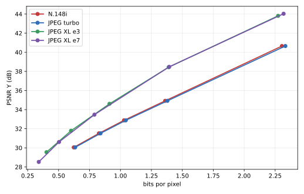
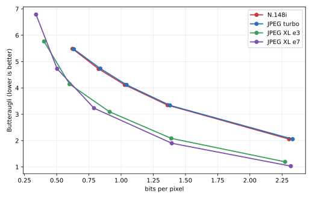

# N.148i — benchmark definitivo contra JPEG e JPEG XL

N.148 / N.148i — Copyright (c) Micilini Roll, licença MIT.

Medição executada entre 5 e 6 de setembro de 2026, no fuso
`America/Sao_Paulo`, sobre 120 imagens e 20 pontos codec/qualidade. O código-base
foi o commit `ddd6192fe90ae053477dca0430627f2f44a196d9`; a instrumentação deste
benchmark está nos arquivos entregues junto com este relatório. Nenhum arquivo
do núcleo do codec foi modificado.

## Resultado em uma frase

Na comparação single-thread, o N.148i superou o libjpeg-turbo ao mesmo tempo em
taxa, encode e decode: precisou de **1,35% a 1,60% menos bits na mesma qualidade**,
usou **25,84% menos tempo no encode (1,349× o throughput)** e **6,70% menos no
decode (1,072× o throughput)**. Contra o
JPEG XL, o resultado se inverte na compressão: o N.148i precisou de **12,87% a
71,88% mais bits**, conforme métrica e esforço, embora tenha sido **7,34× a
89,29× mais rápido no encode** e **9,97× a 10,79× no decode** no eixo
single-thread.

O paralelismo do N.148i é o ponto fraco mais claro: em 10 núcleos físicos o
speedup foi somente **1,386× no encode** e **1,022× no decode**. Além disso, o
alvo de ruído abaixo de 1% foi atingido quase integralmente no eixo
single-thread, mas não no eixo multi-thread; por isso os números do eixo B e da
varredura de threads devem ser lidos com a ressalva estatística documentada na
seção de tempos.

## 1. Ambiente

| Item | Valor observado |
|---|---|
| Máquina | Dell Inspiron 14 5440 |
| CPU | Intel Core 7 150U, 10 núcleos físicos, 12 CPUs lógicos |
| CPU set sem irmãos SMT | `0,2,4,5,6,7,8,9,10,11` |
| Frequência declarada | 400 MHz a 5,4 GHz; frequência não travada |
| ISA detectada | SSE2, SSE4.2, AVX, AVX2 e FMA; sem AVX-512F |
| Sistema | Ubuntu 24.04, Linux `7.0.0-28-generic`, x86-64 |
| Compilador | GCC `13.3.0` (`-O2 -pthread`) |
| Perfil de energia | `balanced`; governor `powersave` nos 12 CPUs lógicos |
| libjpeg efetivamente ligada | libjpeg-turbo `2.1.5`, `/lib/x86_64-linux-gnu/libjpeg.so.8` |
| libjxl da distribuição | `0.7.0`, rejeitada por ser inferior ao mínimo 0.8 |
| libjxl usada | `v0.12.0`, commit `a7a9c787341cf703dede03c2009fa460cae5e5df`, Release/shared |
| Bibliotecas JXL ligadas | `libjxl.so.0.12`, `libjxl_threads.so.0.12`, `libjxl_cms.so.0.12` da instalação local |
| Conversor do corpus | ImageMagick `6.9.12-98 Q16` |
| Python e análise | Python 3.12.3; NumPy 2.5.2; SciPy 1.18.1; scikit-image 0.26.0; Pillow 12.3.0; sewar 0.4.8; Matplotlib 3.11.1 |

A libjxl foi compilada do repositório oficial porque o pacote do sistema era
antigo. Foram usados `CMAKE_BUILD_TYPE=Release`, `BUILD_SHARED_LIBS=ON`,
`JPEGXL_ENABLE_TOOLS=ON`, `JPEGXL_ENABLE_BENCHMARK=OFF` e
`JPEGXL_ENABLE_EXAMPLES=OFF`, seguindo o [BUILDING.md oficial da
v0.12.0](https://github.com/libjxl/libjxl/blob/v0.12.0/BUILDING.md). A tag e as
notas da versão estão na [release oficial
v0.12.0](https://github.com/libjxl/libjxl/releases/tag/v0.12.0).

O `ldd` confirma que `compare` usa `libjpeg.so.8` e que `benchmark-final` usa a
mesma libjpeg mais as bibliotecas JXL locais. A captura integral de `lscpu`,
`uname`, pacotes, `ldd`, CMake, filtros do FFmpeg, versões, hashes dos binários
e perfil de energia está em [`benchmarks/environment.json`](benchmarks/environment.json).
O binário que produziu a matriz tem SHA-256
`4fde6a2893d7e619837f316285927f0b7bdda568679a53aa6abc567ef59ecbc7`.

## 2. Validações de correção

**Todas as barreiras de correção passaram antes da medição.** A saída completa
está em [`benchmarks/validation.log`](benchmarks/validation.log).

| Verificação | Resultado |
|---|---|
| Sentinela `./compare images/example.ppm 50 20` | PASS; N.148i = **2.290 bytes**, exatamente o esperado |
| `./validate` | PASS; `validation PASS (0 failures)` |
| Escalar contra AVX2 | PASS; arquivo e PSNR idênticos byte a byte |
| Dimensão não múltipla de 8 | PASS em 317×241 |
| Croma 0/1/2 | PASS em 4:4:4, 4:2:2 e 4:2:0, sem dessincronização |
| Uma contra quatro threads | PASS; arquivos idênticos em cada modo de croma |
| Consumo do bitstream | PASS; bytes consumidos = bytes de payload escritos em todo roundtrip |
| Matriz completa | PASS; 5.400 linhas únicas, sem célula ausente |
| Determinismo por número de threads no corpus | PASS; zero divergências de tamanho de bitstream nas 120 imagens |

O driver final também valida, dentro de cada chamada, cabeçalho, tabelas de
Huffman, tamanho integral do contêiner, consumo exato do payload e dimensões da
reconstrução. Uma falha interromperia a matriz em vez de gerar uma linha.

## 3. Corpus

O corpus tem **120 PPMs P6 RGB de 8 bits**, todos distintos, com **53.780.086
pixels** no total. Há 15 imagens em cada uma das oito categorias:

| Categoria | Imagens | Pixels mín. / mediana / máx. |
|---|---:|---:|
| Retratos históricos, obras 2D | 15 | 222.208 / 716.160 / 1.324.800 |
| Paisagens naturais | 15 | 174.592 / 426.400 / 565.494 |
| Urbano e arquitetura | 15 | 147.456 / 468.000 / 636.411 |
| Texturas de alta frequência | 15 | 196.608 / 478.400 / 848.241 |
| Superfícies suaves e degradês | 15 | 172.544 / 427.200 / 696.663 |
| Detalhe fino | 15 | 147.456 / 442.400 / 848.241 |
| Texto e bordas nítidas | 15 | 148.160 / 307.200 / 769.035 |
| Cores saturadas e dessaturadas | 15 | 129.024 / 331.560 / 636.411 |

As dimensões variam de 288 a 1.036 pixels de largura e de 252 a 1.600 de
altura; a imagem mediana tem 426.800 pixels. A distribuição por resolução é:

| Faixa | Imagens |
|---|---:|
| menos de 400 mil pixels | 51 |
| 400 a menos de 700 mil | 57 |
| 700 mil a menos de 1 milhão | 7 |
| 1 milhão ou mais | 5 |

### Origem e licenças

| Origem | Imagens |
|---|---:|
| Wikimedia Commons | 15 |
| Openverse / Flickr | 102 |
| Openverse / StockSnap | 2 |
| Openverse / Rawpixel | 1 |

| Licença registrada | Imagens |
|---|---:|
| Domínio público | 8 |
| CC0 / CC0 1.0 | 25 |
| CC BY 2.0 | 87 |

Existem 120 URLs de página, 120 URLs de download, 120 hashes de origem e 120
hashes de PPM únicos. Nenhuma entrada contém pessoa fotografada identificável;
os itens classificados como retrato são pinturas, gravuras ou outras obras 2D
históricas. A procedência e a atribuição de cada arquivo estão em
[`benchmarks/corpus-manifest.json`](benchmarks/corpus-manifest.json) e
[`images/CREDITOS.txt`](images/CREDITOS.txt). O [Openverse se descreve como um
buscador de mídia com licença aberta](https://docs.openverse.org/); como o
agregador não substitui a verificação jurídica da obra, o manifesto conserva
também página, autor, licença, URL da licença e hash.

Das fontes, 118 eram JPEG e duas PNG. Para não conservar a grade DCT do JPEG de
origem, todas as 118 foram redimensionadas espacialmente; as 42 que de outro
modo manteriam o tamanho foram reduzidas em 10%, sem deixar o lado curto cair
abaixo de 320 pixels. Isso não remove os artefatos já presentes na fonte, e é
uma limitação declarada deste corpus.

A normalização foi: primeiro frame, `-auto-orient`, sRGB, redimensionamento sem
ampliação, alpha achatado sobre branco, `-strip`, profundidade 8 e PPM P6. A
auditoria confirmou P6, RGB, 8 bits, carga exata e ausência de alpha em todos
os arquivos. O `convert` do sistema era GraphicsMagick e produzia resultado
diferente para `-colorspace sRGB`; por isso foi usado o ImageMagick verdadeiro
6.9.12-98 e o hash final foi tratado como autoridade.

### Pacote reproduzível

O arquivo preparado para uma release, mas **não publicado por esta execução**, é:

```text
n148i-benchmark-corpus.tar.gz
tamanho: 104835524 bytes (aprox. 100 MiB)
SHA-256: e5cceed5f3ce16b6aaba52bfd2afc4f98c196b58c27c73d512c6cb5103930d19
```

Ele contém exatamente 120 PPMs, `CREDITOS.txt` e `MANIFEST.json`. O manifesto
do pacote e o versionado são byte a byte iguais, SHA-256
`983e41fcb8ae483a946e54ae1c66332c2b045f0840bab07747fbdab4071b6575`.
O plano original mantinha os PPMs e o `.tar.gz` fora do histórico. A política
de publicação foi posteriormente alterada na branch `chore/benchmark-v1`: os
120 PPMs, os dados brutos e o pacote agora são intencionalmente versionados para
permitir auditoria offline. Essa mudança de distribuição não altera imagens,
hashes individuais dos PPMs nem resultados do experimento.

O hash do pacote foi atualizado ao acrescentar aos créditos a declaração
explícita das transformações feitas nas obras; os 120 PPMs e seus hashes
individuais permaneceram inalterados.

[`tools/fetch_corpus.py`](tools/fetch_corpus.py) baixa cada origem, verifica o
hash do download, repete a conversão armazenada no manifesto, valida estrutura
e dimensões do PPM e só instala o arquivo se o SHA-256 final coincidir. Link
quebrado, origem alterada, conversor incompatível ou hash divergente resultam
em aviso e código de saída diferente de zero. Nesta máquina, a verificação dos
120 arquivos terminou em PASS; uma fonte PNG e uma JPEG também foram
reconstruídas do zero como teste e ficaram byte a byte idênticas.

## 4. Metodologia

### Configuração dos codecs

| Codec | Pontos | Configuração |
|---|---|---|
| N.148i | qualidade 30, 45, 60, 75, 90 | 4:2:0, Huffman otimizado, contêiner completo, despacho SIMD em runtime |
| libjpeg-turbo | qualidade 30, 45, 60, 75, 90 | 4:2:0, `optimize_coding=TRUE`, `jpeg_set_quality(..., TRUE)` |
| JPEG XL rápido | distância 8, 5, 3, 1,5, 0,7 | esforço 3, sRGB 8-bit, modo lossy pela API C |
| JPEG XL padrão | distância 8, 5, 3, 1,5, 0,7 | esforço 7, sRGB 8-bit, modo lossy pela API C |

O mapeamento de cinco pontos do JXL foi escolhido para cobrir a mesma faixa de
qualidade observada no N.148i/JPEG, não por equivalência nominal. Em PSNR RGB,
por exemplo, o JXL esforço 3 cobriu 28,23–38,20 dB e o N.148i 28,72–36,59 dB.
Todas as comparações de tamanho usam a interseção efetiva das curvas, nunca o
número de qualidade.

O novo [`src/benchmark_final_cli.c`](src/benchmark_final_cli.c) chama N.148i,
libjpeg-turbo e libjxl diretamente no mesmo processo. O PPM é carregado antes
da região cronometrada; escrita, leitura de disco, criação de processo e cálculo
de métricas ficam fora dela. A medição inclui a operação completa da API do
codec, incluindo criação/destruição do contexto, alocações, otimização das
tabelas e serialização do bitstream; não mede um atalho interno incompleto.

### Eixos de CPU

| Eixo | N.148i | JPEG | JPEG XL | Afinidade |
|---|---:|---:|---:|---|
| A, eficiência | 1 thread | 1 thread | caller, runner com 0 workers | CPU 0 |
| B, throughput | 10 threads totais | 1 thread | runner com 10 workers | 10 núcleos físicos, sem irmãos SMT |
| Varredura N.148i | 1, 2, 4, 8 e 10 threads | — | — | primeiros N núcleos físicos |

No eixo B, o JPEG permanece single-thread por imagem e é fixado na CPU 0. O
runner JXL foi configurado explicitamente com 10 workers e confinado ao CPU set
de 10 núcleos. A varredura do N.148i usa qualidade 60 sobre o corpus inteiro.

### Cronometragem, alternância e ruído

Cada amostra agrega chamadas internas suficientes para aproximadamente 20 ms.
Foram descartadas três amostras de aquecimento e usada a mediana das demais.
A ordem dos quatro codecs gira a cada réplica; encode e decode percorrem ordens
opostas. A ordem dos cinco pontos também gira por imagem. Isso distribui deriva
de frequência e temperatura entre os concorrentes.

Cada linha bruta conserva mediana, média, desvio padrão, IQR, MAD, coeficiente
de variação e a incerteza robusta abaixo, separadamente para encode e decode.

A incerteza usada para decidir novas réplicas foi o erro-padrão relativo robusto
da mediana:

```text
100 × 1,253314 × 1,4826 × MAD / (mediana × √n)
```

As séries começaram com 15 réplicas e subiram pelos patamares `2^k-1` até 255
no eixo A. Resultado observado:

| Eixo | Linhas | ≤1% | Acima de 1% | Ruído mediano | p95 | Máximo | Réplicas |
|---|---:|---:|---:|---:|---:|---:|---:|
| A, single-thread | 2.400 | 2.384 | 16 | 0,319% | 0,845% | 3,419% | 15–255 |
| B, throughput | 2.400 | 38 | 2.362 | 3,040% | 5,847% | 9,005% | 31–255 |
| Varredura | 600 | 330 | 270 | 0,947% | 2,553% | 4,916% | 15–31 |

Portanto, o requisito de ruído abaixo de 1% foi satisfeito em **99,33% do eixo
A**, mas não no eixo B. Pilotos multi-thread continuaram entre aproximadamente
1,5% e 2,8% mesmo com 255 réplicas. Depois do ponto ordinal 613, o teto desses
dois eixos foi fixado em 31 para evitar uma extensão superior a um dia sem
convergência. Os resíduos foram preservados, não ocultados. Assim, o eixo A é a
conclusão de desempenho mais forte; eixo B e escalabilidade são evidência
indicativa que merece repetição numa máquina isolada, com frequência travada.

Durante a execução, uma tarefa alheia ao projeto saturou o disco e interrompeu
o processo. Os checkpoints atômicos impediram linhas parciais, e a medição só
foi retomada depois que a máquina ficou ociosa. Uma falha inicial na chave de
retomada representou sete pontos JPEG como se tivessem 10 threads. A deduplicação
removeu sete resumos e 217 amostras duplicadas pela regra determinística
"maior número de réplicas; primeira amostra numerada original", nunca pelo
tempo medido. Ambos os eventos, cada comando efetivamente executado e cada
refinamento estão em
[`benchmarks/benchmark-metadata.json`](benchmarks/benchmark-metadata.json).

### Qualidade e estatística

Foram calculados PSNR RGB, PSNR Y (luminância), SSIM, MS-SSIM, SSIMULACRA2 e
Butteraugli. SSIMULACRA2 e Butteraugli vieram das ferramentas construídas com a
mesma libjxl v0.12.0; a implementação usada pode ser auditada no [código oficial
do SSIMULACRA2](https://github.com/libjxl/libjxl/blob/v0.12.0/tools/ssimulacra2.cc).
VMAF não foi obtido porque o FFmpeg instalado expõe `vmafmotion`, mas não o
filtro `libvmaf`.

O BD-rate foi calculado em log(taxa) com PCHIP, apenas sobre pontos de Pareto e
o intervalo comum de qualidade, sem extrapolação. Para Butteraugli, cujo menor
valor é melhor, o sinal da qualidade foi invertido antes da integração. Essa é
uma variante numericamente mais estável da medida de Bjøntegaard original; a
definição histórica está no [documento VCEG-M33 de
Bjøntegaard](https://eclass.uoa.gr/modules/document/file.php/D221/%CE%A3%CE%B7%CE%BC%CE%B5%CE%B9%CF%8E%CF%83%CE%B5%CE%B9%CF%82/VCEG-M33%20%28Bjontegaard%20Delta%29.pdf),
e as armadilhas de implementação modernas são discutidas neste [tutorial de
BD-rate](https://arxiv.org/abs/2401.04039).

As curvas agregadas usam bpp do corpus inteiro, PSNR obtido do MSE combinado
por pixels e média ponderada por pixels para as outras métricas. Também foi
calculado o BD-rate individual por imagem. Vitória/empate/derrota usa tolerância
de ±1%. Significância usa Wilcoxon pareado, bicaudal; diferenças entre categorias
usam Kruskal–Wallis. Valor-p mostra incompatibilidade com diferença nula, não o
tamanho do efeito.

A matriz final tem **5.400 resumos únicos** e **197.440 amostras individuais**.
Os CSVs mantêm os valores sem arredondamento.

## 5. Resultados de compressão: BD-rate

Sinal negativo favorece o N.148i; sinal positivo significa que ele precisa de
mais bits que o concorrente para a mesma qualidade. `V/E/D` significa vitória,
empate e derrota do N.148i por imagem, usando ±1%.

### N.148i contra libjpeg-turbo

| Métrica | BD-rate agregado | Mediana por imagem [Q1; Q3] | V/E/D | Wilcoxon p |
|---|---:|---:|---:|---:|
| PSNR RGB | **-1,384%** | -1,588% [-2,235; -1,173] | 96/24/0 | 1,97e-21 |
| PSNR Y | **-1,325%** | -1,478% [-2,011; -1,072] | 96/24/0 | 1,97e-21 |
| SSIM | **-1,599%** | -1,820% [-2,852; -1,159] | 98/22/0 | 2,60e-21 |
| MS-SSIM | **-1,403%** | -1,619% [-2,391; -1,127] | 99/21/0 | 1,97e-21 |
| SSIMULACRA2 | **-1,390%** | -1,520% [-2,293; -1,144] | 94/26/0 | 1,97e-21 |
| Butteraugli | **-1,355%** | -1,509% [-2,692; -0,609] | 76/35/9 | 3,33e-13 |

O ganho agregado é pequeno, consistente e estatisticamente forte nas seis
métricas. O caso perceptual não é uniforme: Butteraugli encontra nove derrotas
individuais que PSNR/SSIM escondem.

### N.148i contra JPEG XL

| Métrica | JXL e3: BD-rate / V-E-D | JXL e7: BD-rate / V-E-D |
|---|---:|---:|
| PSNR RGB | **+34,586%** / 6-2-111* | **+38,594%** / 4-0-116 |
| PSNR Y | **+41,963%** / 8-0-112 | **+40,982%** / 4-0-116 |
| SSIM | **+17,803%** / 8-0-111* | **+31,716%** / 2-0-118 |
| MS-SSIM | **+12,868%** / 8-1-111 | **+20,697%** / 9-1-110 |
| SSIMULACRA2 | **+30,183%** / 0-0-120 | **+41,517%** / 0-0-120 |
| Butteraugli | **+64,079%** / 0-0-119* | **+71,880%** / 0-0-120 |

`*` Uma curva individual não teve três pontos de Pareto e sobreposição
suficiente: imagem 88 em PSNR RGB/SSIM contra e3 e imagem 90 em Butteraugli.
Ela foi marcada como ausente, não extrapolada. Os valores-p contra e3 ficaram
entre 1,97e-21 e 4,63e-19; contra e7, entre 1,97e-21 e 6,56e-20.

JPEG XL vence inequivocamente em eficiência de compressão. A amplitude da
derrota do N.148i depende muito da métrica: 12,87% em MS-SSIM contra e3, mas
64,08% em Butteraugli; contra e7, 20,70% e 71,88%, respectivamente. Não há uma
métrica honesta que transforme esse resultado agregado numa vitória do N.148i.

## 6. Resultados de qualidade e curvas taxa–distorção

Esta tabela é a curva agregada do corpus. Butteraugli é melhor para baixo;
todas as outras métricas são melhores para cima.

| Codec / ponto | bpp | PSNR RGB | PSNR Y | SSIM | MS-SSIM | SSIMULACRA2 | Butteraugli |
|---|---:|---:|---:|---:|---:|---:|---:|
| N.148i q30 | 0,623 | 28,725 | 30,048 | 0,8610 | 0,97185 | 47,915 | 5,486 |
| N.148i q45 | 0,826 | 30,006 | 31,514 | 0,8889 | 0,97997 | 59,639 | 4,721 |
| N.148i q60 | 1,028 | 31,116 | 32,876 | 0,9081 | 0,98461 | 66,461 | 4,117 |
| N.148i q75 | 1,361 | 32,725 | 34,917 | 0,9305 | 0,98947 | 74,256 | 3,347 |
| N.148i q90 | 2,305 | 36,590 | 40,649 | 0,9644 | 0,99516 | 84,608 | 2,056 |
| JPEG q30 | 0,634 | 28,729 | 30,049 | 0,8611 | 0,97188 | 47,969 | 5,471 |
| JPEG q45 | 0,839 | 30,007 | 31,515 | 0,8888 | 0,97999 | 59,717 | 4,737 |
| JPEG q60 | 1,043 | 31,116 | 32,878 | 0,9080 | 0,98462 | 66,454 | 4,116 |
| JPEG q75 | 1,380 | 32,724 | 34,920 | 0,9303 | 0,98947 | 74,224 | 3,338 |
| JPEG q90 | 2,332 | 36,583 | 40,652 | 0,9641 | 0,99516 | 84,620 | 2,055 |
| JXL e3 d8 | 0,402 | 28,228 | 29,544 | 0,8280 | 0,95998 | 41,962 | 5,765 |
| JXL e3 d5 | 0,600 | 30,043 | 31,787 | 0,8741 | 0,97437 | 57,386 | 4,142 |
| JXL e3 d3 | 0,912 | 32,144 | 34,608 | 0,9113 | 0,98456 | 70,050 | 3,091 |
| JXL e3 d1,5 | 1,390 | 34,756 | 38,438 | 0,9441 | 0,99149 | 80,841 | 2,085 |
| JXL e3 d0,7 | 2,274 | 38,202 | 43,812 | 0,9704 | 0,99635 | 89,025 | 1,193 |
| JXL e7 d8 | 0,340 | 27,580 | 28,527 | 0,8182 | 0,95683 | 39,525 | 6,787 |
| JXL e7 d5 | 0,504 | 29,307 | 30,613 | 0,8649 | 0,97202 | 55,241 | 4,726 |
| JXL e7 d3 | 0,790 | 31,564 | 33,473 | 0,9086 | 0,98316 | 68,636 | 3,232 |
| JXL e7 d1,5 | 1,394 | 34,970 | 38,478 | 0,9526 | 0,99191 | 81,322 | 1,899 |
| JXL e7 d0,7 | 2,318 | 38,336 | 44,031 | 0,9753 | 0,99641 | 89,092 | 1,031 |

Os valores completos estão em
[`benchmarks/analysis/rate-distortion.csv`](benchmarks/analysis/rate-distortion.csv).

### Curvas agregadas







Contra JPEG, em 102 das 120 imagens nenhuma métrica se opôs ao N.148i: todas
indicaram vitória ou empate e ao menos uma indicou vitória. Nas 18 restantes
houve inversão entre métricas. Contra JXL e3, 105 imagens tiveram somente
derrota ou empate do N.148i, 13 tiveram discordância e duas ficaram incompletas;
contra e7 foram 107 sem oposição à vitória do JXL e 13 discordâncias.

O exemplo mais forte é `corpus-0107.ppm`, *Color Abstract*: contra JXL e3,
PSNR RGB estima **-40,78%** e SSIM **-27,95%** de BD-rate, ambos favoráveis ao
N.148i; SSIMULACRA2 estima **+69,01%** e Butteraugli **+163,35%**, ambos
fortemente favoráveis ao JXL. A hipótese compatível com a imagem é que
PSNR/SSIM premiam a semelhança média e a suavização, enquanto as métricas
perceptuais reagem à estrutura e aos artefatos nas transições saturadas. Isso é
um resultado, não um motivo para escolher apenas a métrica favorável.

## 7. Resultados de tempo

O percentual abaixo é a média geométrica de todas as razões pareadas
N.148i/concorrente nos cinco pontos, menos um; valor negativo significa redução
de tempo do N.148i. Os fatores `×` são o inverso da razão de tempo e representam
throughput relativo. A contagem V/E/D é por imagem depois de combinar
geometricamente os cinco pontos.

| Eixo | Concorrente | Operação | Diferença N.148i | V/E/D | Wilcoxon p |
|---|---|---|---:|---:|---:|
| A | JPEG | encode | **-25,844%** | 120/0/0 | 1,97e-21 |
| A | JPEG | decode | **-6,700%** | 118/2/0 | 1,97e-21 |
| A | JXL e3 | encode | **-86,373%** (7,34×) | 120/0/0 | 1,97e-21 |
| A | JXL e3 | decode | **-90,735%** (10,79×) | 120/0/0 | 1,97e-21 |
| A | JXL e7 | encode | **-98,880%** (89,29×) | 120/0/0 | 1,97e-21 |
| A | JXL e7 | decode | **-89,969%** (9,97×) | 120/0/0 | 1,97e-21 |
| B | JPEG | encode | **-32,749%** | 119/1/0 | 2,02e-21 |
| B | JPEG | decode | **-14,965%** | 120/0/0 | 1,97e-21 |
| B | JXL e3 | encode | **-87,214%** (7,82×) | 120/0/0 | 1,97e-21 |
| B | JXL e3 | decode | **-89,993%** (9,99×) | 120/0/0 | 1,97e-21 |
| B | JXL e7 | encode | **-98,314%** (59,32×) | 120/0/0 | 1,97e-21 |
| B | JXL e7 | decode | **-88,172%** (8,45×) | 120/0/0 | 1,97e-21 |

No eixo A, a distribuição pareada por imagem reforça o agregado. Contra
JPEG, a mediana [Q1; Q3] foi -26,83% [-29,85%; -20,97%] no encode e -6,67%
[-8,05%; -5,39%] no decode. A dispersão integral, inclusive IQR por operação,
está em [`benchmarks/analysis/timing-summary.csv`](benchmarks/analysis/timing-summary.csv).

Os números contra JXL emparelham os cinco pontos do mapeamento documentado; os
pontos cobrem a mesma faixa, mas não têm qualidade exatamente igual. Mesmo a
comparação absoluta mais desfavorável dentro da faixa mantém margem larga, mas
os multiplicadores não devem ser interpretados como tempo interpolado numa
qualidade exata. Contra JPEG, as reconstruções em cada qualidade nominal têm
métricas praticamente iguais, tornando a comparação de tempo diretamente
equivalente.

### Throughput absoluto

Somaram-se as medianas das 120 imagens em todos os cinco pontos, isto é,
268.900.430 pixels-operação por codec:

| Eixo | Codec | Threads/workers | Encode MP/s | Decode MP/s |
|---|---|---:|---:|---:|
| A | N.148i | 1 | **238,32** | **405,59** |
| A | JPEG | 1 | 172,99 | 378,58 |
| A | JXL e3 | caller, 0 workers | 34,01 | 37,67 |
| A | JXL e7 | caller, 0 workers | 2,73 | 42,89 |
| B | N.148i | 10 | **271,02** | **410,46** |
| B | JPEG | 1 | 169,08 | 351,14 |
| B | JXL e3 | 10 workers | 37,04 | 46,88 |
| B | JXL e7 | 10 workers | 4,81 | 56,30 |

Os valores por ponto, em milissegundos e MP/s, estão em
[`benchmarks/analysis/timing-by-point.csv`](benchmarks/analysis/timing-by-point.csv).
O eixo B não atingiu o alvo de ruído e não deve substituir o eixo A numa frase
genérica como "X% mais rápido".

Há ainda um sinal direto de sensibilidade ao contexto: em q60, o corpus N.148i
com 10 threads levou 190,411 ms no eixo B intercalado com os codecs JXL e
146,758 ms na varredura isolada, diferença de 29,7%. Aquecimento, frequência e
histórico de carga são hipóteses plausíveis, não causas demonstradas. A
comparação pareada do eixo B e a curva isolada de escalabilidade respondem a
perguntas diferentes e não devem ser misturadas.

### Escalabilidade do N.148i

Varredura em qualidade 60, sobre os mesmos 53.780.086 pixels:

| Threads | Encode ms | Speedup | Eficiência | Decode ms | Speedup | Eficiência |
|---:|---:|---:|---:|---:|---:|---:|
| 1 | 203,368 | 1,000× | 100,0% | 118,576 | 1,000× | 100,0% |
| 2 | 158,850 | 1,280× | 64,0% | 114,278 | **1,038×** | 51,9% |
| 4 | 193,455 | 1,051× | 26,3% | 124,192 | 0,955× | 23,9% |
| 8 | 151,836 | 1,339× | 16,7% | 116,862 | 1,015× | 12,7% |
| 10 | 146,758 | **1,386×** | 13,9% | 115,981 | 1,022× | 10,2% |

O teto prático aparece muito cedo. O encode ainda melhora até 10 threads,
mas somente 38,6% sobre uma thread e de forma não monotônica; o decode tem seu
melhor valor em duas threads e fica essencialmente plano depois disso. A
hipótese é uma combinação de trechos seriais, granularidade por imagem,
sincronização e frequência/temperatura, mas este benchmark não instrumentou
ciclos ou contenção para separar as causas. A incerteza residual da varredura
também impede interpretar a regressão em quatro threads como uma lei do codec.


## 8. Análise estatística, categorias e extremos

Todos os testes pareados dos resultados centrais rejeitam diferença nula com
grande margem. Contra JPEG, o maior valor-p de BD-rate é 3,33e-13; contra JXL,
4,63e-19. Nos tempos, todos ficam em torno de 2e-21. Esses valores devem ser
lidos junto com os efeitos: aproximadamente 1,4% de taxa contra JPEG é um
ganho real, mas pequeno; dezenas de por cento contra JXL são efeitos grandes.

As diferenças de BD-rate entre as oito categorias foram significativas em
todas as 18 combinações concorrente/métrica (`p < 0,004`, Kruskal–Wallis).
Mesmo assim, **nenhuma categoria inverteu o vencedor agregado**: o N.148i ficou
melhor que JPEG nas oito e pior que JXL nas oito.

Contra JPEG, superfícies suaves e degradês foram a melhor categoria do N.148i:
medianas de -2,77% em PSNR RGB, -4,09% em SSIM e -2,67% em Butteraugli. Texturas
de alta frequência foram a mais próxima do empate: -1,02%, -1,05% e -0,70%,
respectivamente. Isso sugere que o pequeno ganho sobre JPEG vem mais de regiões
suaves que de detalhe muito fino.

Os extremos mais informativos foram:

- `corpus-0073.ppm`, *Polar Mesospheric Clouds*: melhor caso contra JPEG,
  -12,58% em PSNR RGB e -16,09% em Butteraugli.

- `corpus-0107.ppm`, *Color Abstract*: pior caso Butteraugli contra JPEG,
  +11,79%, e o exemplo mais claro de discordância contra JXL.

- Butteraugli registrou nove derrotas individuais contra JPEG. Depois de
  *Color Abstract*, as maiores foram `corpus-0034.ppm` (*UF Architecture*,
  +3,71%), `corpus-0031.ppm` (*Illuminated Architecture*, +3,21%) e
  `corpus-0005.ppm` (gravura de Nguyen Sieu, +3,08%).

- Contra JXL, os extremos individuais podem ultrapassar 100% quando o intervalo
  comum de uma imagem é estreito. Eles são mantidos no CSV, mas não usados como
  manchete; o agregado do corpus e a mediana por imagem são mais estáveis.

As tabelas completas estão em
[`category-summary.csv`](benchmarks/analysis/category-summary.csv),
[`category-tests.csv`](benchmarks/analysis/category-tests.csv) e
[`extremes.csv`](benchmarks/analysis/extremes.csv). Os testes por categoria são
exploratórios e não receberam correção por comparações múltiplas.

## 9. Veredito explícito

1. **Single-thread contra libjpeg-turbo:** sim, o N.148i vence simultaneamente
   em tamanho, encode e decode nesta máquina. O ganho de taxa é 1,35–1,60%
   conforme a métrica; usou 25,84% menos tempo no encode (1,349× o throughput)
   e 6,70% menos no decode (1,072×). Não houve
   derrota por imagem em PSNR/SSIM/SSIMULACRA2 com tolerância de 1%; houve nove
   derrotas em Butteraugli.

2. **Contra JPEG XL:** o N.148i perde em compressão. Precisa de 12,87–64,08%
   mais bits que JXL e3 e 20,70–71,88% mais que JXL e7, dependendo da métrica.
   Em troca, no eixo A é 7,34×/10,79× mais rápido que e3 em encode/decode e
   89,29×/9,97× mais rápido que e7. Portanto, N.148i ocupa o extremo de baixa
   latência; JXL ocupa o extremo de eficiência de compressão.

3. **Concordância das métricas:** elas concordam no vencedor agregado, mas não
   em todas as imagens nem na magnitude. Houve 18 discordâncias contra JPEG e
   13 contra cada esforço JXL. Butteraugli é especialmente menos favorável ao
   N.148i que PSNR/SSIM.

4. **Tipo de imagem:** nenhuma das oito categorias inverte o resultado global.
   A margem, porém, muda significativamente: o ganho contra JPEG cresce em
   suaves/degradês e quase desaparece em texturas; cores saturadas contêm os
   maiores conflitos entre métricas.

5. **Paralelismo:** o teto é baixo e precoce. O máximo observado foi 1,386× no
   encode com 10 threads, 13,9% de eficiência; o decode atingiu 1,038× com duas
   e não melhorou depois. Este é um eixo em que o N.148i ainda perde para o que
   se esperaria de escalabilidade multicore, apesar de continuar mais rápido em
   tempo absoluto que os concorrentes testados.

## 10. Limitações

- Foi medida uma única CPU móvel x86-64. ARM, desktops de alto TDP, servidores,
  CPUs sem AVX2 e outras implementações podem mudar as proporções.

- Frequência e temperatura não foram travadas; o perfil ficou em `balanced` e
  o governor em `powersave`. A alternância pareada reduz o viés entre codecs,
  mas não elimina a variância, sobretudo com threads.

- O alvo inferior a 1% não foi atingido no eixo B nem em toda a varredura.
  Margens enormes contra JXL dificilmente mudariam de sinal, mas os percentuais
  multi-thread exatos não têm o mesmo grau de evidência do eixo A.

- 118 das 120 fontes eram JPEG. O redimensionamento quebra a grade DCT original,
  mas não apaga compressão prévia. Um corpus nascido em RAW/PNG poderia mudar
  o ranking e deve ser uma replicação futura.

- As imagens chegam a 1,325 megapixel. O corpus é variado, mas não mede fotos
  de dezenas de megapixels, thumbnails muito pequenos, imagens científicas,
  HDR, alpha, animação, lossless, metadados ou transmissão progressiva.

- A categoria de retratos usa obras 2D históricas para evitar pessoas
  identificáveis sem liberação; ela não representa fotografia moderna de pele.

- JPEG XL foi testado apenas na v0.12.0, esforços 3 e 7 e cinco distâncias. Uma
  versão futura ou outro esforço pode deslocar tempo e taxa.

- O tempo inclui inicialização e destruição do contexto para uma imagem. Um
  serviço que reutilize estado ou processe muitas imagens simultaneamente pode
  obter outro throughput.

- BD-rate resume apenas a faixa de sobreposição dos cinco pontos. Curvas
  individuais estreitas geram extremos instáveis; nenhuma extrapolação foi
  feita e três resultados ausentes foram explicitamente marcados.

- VMAF não estava disponível. As seis métricas obtidas já demonstram que uma
  conclusão perceptual depende da métrica escolhida.

- Licenças e atribuições foram registradas a partir das páginas e APIs de
  origem. URLs podem quebrar ou o provedor pode corrigir metadados no futuro;
  o hash detecta mudança, mas não concede direitos adicionais.

## 11. Dados brutos e reprodução

Arquivos versionáveis entregues:

- [`benchmarks/final-results.csv`](benchmarks/final-results.csv): 5.400 linhas,
  uma por imagem, codec, ponto e eixo, sem arredondamento;
- [`benchmarks/timing-samples.csv`](benchmarks/timing-samples.csv): 197.440
  réplicas individuais;
- [`benchmarks/benchmark-metadata.json`](benchmarks/benchmark-metadata.json):
  todos os comandos, hashes, retomadas e emendas de protocolo;
- [`benchmarks/environment.json`](benchmarks/environment.json): ambiente bruto;
- [`benchmarks/analysis/`](benchmarks/analysis/): BD-rate por imagem, dispersão,
  categorias, extremos, Wilcoxon, Kruskal–Wallis, tempos e escalabilidade;
- [`benchmarks/corpus-manifest.json`](benchmarks/corpus-manifest.json),
  [`images/MANIFEST.json`](images/MANIFEST.json) e
  [`images/CREDITOS.txt`](images/CREDITOS.txt);
- [`tools/fetch_corpus.py`](tools/fetch_corpus.py),
  [`tools/benchmark_final.py`](tools/benchmark_final.py),
  [`tools/analyze_final_benchmark.py`](tools/analyze_final_benchmark.py) e
  [`tools/collect_benchmark_environment.py`](tools/collect_benchmark_environment.py).

### Comandos de construção e reprodução

```bash
git clone --recursive --branch v0.12.0 https://github.com/libjxl/libjxl \
  /tmp/n148-libjxl-0.12.0
cmake -S /tmp/n148-libjxl-0.12.0 -B /tmp/n148-libjxl-0.12.0/build \
  -DCMAKE_BUILD_TYPE=Release -DBUILD_SHARED_LIBS=ON \
  -DJPEGXL_ENABLE_TOOLS=ON -DJPEGXL_ENABLE_BENCHMARK=OFF \
  -DJPEGXL_ENABLE_EXAMPLES=OFF \
  -DCMAKE_INSTALL_PREFIX=/tmp/n148-libjxl-0.12.0/install
cmake --build /tmp/n148-libjxl-0.12.0/build -j10
cmake --install /tmp/n148-libjxl-0.12.0/build

make
make bench
make compare
make validate
make benchmark-final JXL_PREFIX=/tmp/n148-libjxl-0.12.0/install
```

### Reconstrução e verificação do corpus

Com ImageMagick 6.9.12-98 disponível como `convert`:

```bash
python3 tools/fetch_corpus.py
```

Nesta máquina a instalação local exigiu:

```bash
LD_LIBRARY_PATH="$PWD/.benchmark-deps/imagemagick/usr/lib/x86_64-linux-gnu" \
python3 tools/fetch_corpus.py \
  --convert-binary .benchmark-deps/imagemagick/usr/bin/convert-im6.q16
```

### Benchmark e análise

```bash
PYTHONPATH=.benchmark-deps/python \
python3 tools/benchmark_final.py \
  --reps 15 --max-reps 255 --parallel-max-reps 31 \
  --warmups 3 --sample-ms 20 --noise-target-pct 1

PYTHONPATH=.benchmark-deps/python \
python3 tools/analyze_final_benchmark.py

PYTHONPATH=.benchmark-deps/python \
python3 tools/collect_benchmark_environment.py \
  --convert-binary .benchmark-deps/imagemagick/usr/bin/convert-im6.q16
```

O comando de reprodução acima aplica desde o início o teto multi-thread de 31
réplicas decidido durante a execução. Para reproduzir literalmente a história
dos pilotos e retomadas, inclusive os poucos pontos com 255 réplicas, use a
lista `commands` do metadata.

### Empacotamento

```bash
cd images
tar -czf ../n148i-benchmark-corpus.tar.gz \
  corpus-*.ppm CREDITOS.txt MANIFEST.json
cd ..
stat -c '%n %s bytes' n148i-benchmark-corpus.tar.gz
sha256sum n148i-benchmark-corpus.tar.gz
```

Nenhum `.n148i`, `.jpg` ou `.jxl` transitório da medição foi conservado. O
único `output/image.n148i` presente é um fixture que já era versionado no
commit-base e não foi produzido por este benchmark.
