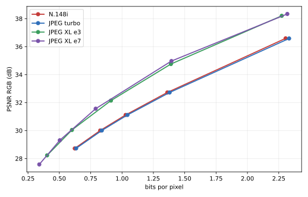
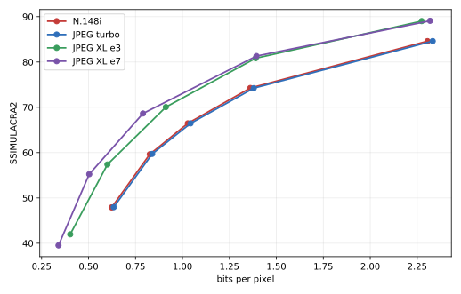

<div align="center">

# N.148i

### A handcrafted image codec, built from first principles in C

[](src/)
[](LICENSE)
[](benchmarks/corpus-manifest.json)
[](benchmarks/validation.log)
[](#n148i-v3-bitstream)

N.148i is an experimental lossy image codec in the same design space as
baseline JPEG: 8×8 DCT, quantization, zig-zag ordering, run-length encoding,
and canonical Huffman coding. It adds runtime AVX2/FMA dispatch, a portable
scalar path, optimized per-image Huffman tables, and a persistent pthread
worker pool.

[Read the benchmark](BENCHMARK.md) ·
[Explore the source](src/) ·
[Follow the codec series](https://micilini.com/conteudos/codecs)


<sub>Eight real inputs from the committed benchmark corpus: historical art,
landscape, architecture, texture, smooth sky, fine detail, typography, and
saturated color. [Image attribution](docs/assets/readme/README.md).</sub>

</div>

## What is N.148i?

N.148i began as a question: how much of an image codec can be understood by
building every stage instead of calling a compression library?

The answer in this repository is a complete encoder, decoder, and versioned
binary format written in plain C. Color conversion, chroma subsampling, block
transforms, quantization, entropy coding, container serialization, corruption
checks, SIMD dispatch, and threading are all visible and testable. The project
is educational and experimental; it is not a replacement for a standardized,
widely deployed format.

The complete creation journey is documented at
**[micilini.com/conteudos/codecs](https://micilini.com/conteudos/codecs)**. The
Portuguese-language series follows the codec from its first pixels and
bitstream through six optimization milestones. The Git history mirrors that
journey, so readers can inspect not just the final implementation, but how it
evolved.

## How it works


The encoder stores all Y blocks first, followed by Cb and Cr, with an
independent DC predictor for each plane. Entropy writing and predictor chains
remain ordered; independent color, transform, histogram, and reconstruction
work can run in parallel. At runtime, CPUID and operating-system AVX-state
checks select the best supported path without making the binary unportable.

Key implementation properties:

- binary P6 PPM input and output, RGB24, with no external image wrapper;
- selectable 4:4:4, 4:2:2, and 4:2:0 chroma;
- scalar and AVX2 AAN forward/inverse DCT implementations;
- AVX2/FMA color conversion and vectorized chroma processing;
- sparse and dense inverse reconstruction paths;
- per-image optimized canonical Huffman tables;
- complete v3 container validation before entropy decoding;
- deterministic compressed bytes across validated scalar, AVX2, and worker
  counts;
- threaded and `NOTHREADS=1` builds from the same source tree.

## A real round trip

This example uses the repository's 320×240 fixture, quality 50, optimized
Huffman tables, and 4:2:0 chroma.

| Original | N.148i reconstruction | Absolute RGB error, amplified 8× |
|:---:|:---:|:---:|
|  |  |  |
| 230,415-byte PPM | 2,290-byte `.n148i` | Visualization only |

The result is a **100.6:1 compression ratio relative to the uncompressed PPM**,
and the reconstruction measures **34.70 dB PSNR**. PPM is intentionally used
as the uncompressed interchange format; this ratio is not a comparison against
PNG or another compressed source.

## Benchmark results

The final benchmark uses 120 redistributable images, five operating points per
codec, direct in-process C APIs, disk I/O outside timed regions, CPU affinity,
warm-up removal, interleaved codec order, and per-image paired statistics.
N.148i and libjpeg-turbo use 4:2:0 plus optimized Huffman coding. JPEG XL 0.12.0
is tested at effort 3 and effort 7.

These are the measured results on an Intel Core 7 150U. They are not marketing
estimates. The complete environment, methodology, uncertainty, per-image
results, and limitations are in **[BENCHMARK.md](BENCHMARK.md)**.

### Compression efficiency at equal quality

BD-rate integrates each codec's rate–distortion curve over its common quality
range. Negative values mean N.148i needs fewer bits; positive values mean it
needs more.

| Quality metric | vs libjpeg-turbo | vs JPEG XL e3 | vs JPEG XL e7 |
|---|---:|---:|---:|
| PSNR RGB | **-1.38%** | +34.59% | +38.59% |
| PSNR Y | **-1.33%** | +41.96% | +40.98% |
| SSIM | **-1.60%** | +17.80% | +31.72% |
| MS-SSIM | **-1.40%** | +12.87% | +20.70% |
| SSIMULACRA2 | **-1.39%** | +30.18% | +41.52% |
| Butteraugli | **-1.35%** | +64.08% | +71.88% |

The honest reading is straightforward: **N.148i is slightly more compact than
libjpeg-turbo over this range, while JPEG XL is substantially more compact than
N.148i.** Butteraugli also finds nine individual images where JPEG beats
N.148i, despite N.148i winning the aggregate.

| PSNR RGB rate–distortion | SSIMULACRA2 rate–distortion |
|:---:|:---:|
|  |  |

### Single-thread speed

The table reports the geometric mean of paired N.148i/competitor timing ratios
over all 120 images and five mapped operating points.

| Competitor | N.148i encode result | N.148i decode result | Images won/tied/lost |
|---|---:|---:|---:|
| libjpeg-turbo | **25.84% less time** (1.349× throughput) | **6.70% less time** (1.072× throughput) | 120/0/0 encode, 118/2/0 decode |
| JPEG XL effort 3 | **7.34× faster** | **10.79× faster** | 120/0/0 in both |
| JPEG XL effort 7 | **89.29× faster** | **9.97× faster** | 120/0/0 in both |

JPEG and N.148i produce nearly identical quality at each shared nominal point.
JPEG XL uses a documented distance mapping that spans the same quality range,
but its five points are not exact quality matches; the JXL speed multipliers
must therefore not be read as interpolated timings at one exact PSNR.

### Thread scaling

N.148i's multicore result is its clearest weakness. At quality 60, 10 threads
reach only **1.386× encode speedup** and **1.022× decode speedup**. The best
decode result is 1.038× at two threads.


The single-thread timing target was met by 99.33% of measured series. The
multi-thread axis retained 3.04% median residual timing uncertainty and is
reported as indicative rather than definitive. This limitation is preserved
in the data and discussed in the full report.

### Do the metrics agree?

Not always. Against JPEG, 18 of 120 images contain a metric-level inversion.
Against each JPEG XL effort, 13 images do. The strongest example is
`corpus-0107.ppm`: PSNR RGB and SSIM favor N.148i against JXL effort 3, while
SSIMULACRA2 and Butteraugli strongly favor JPEG XL. The repository reports the
disagreement instead of selecting the metric that makes one codec look best.

## The complete test corpus is in this repository

Unlike the earlier lightweight layout, this branch intentionally commits all
120 binary P6 files under [`images/`](images/), together with the raw benchmark
outputs. That makes the experiment inspectable without trusting a summary.

| Corpus property | Value |
|---|---:|
| Images | 120 |
| Categories | 8, with 15 images each |
| Total pixels | 53,780,086 |
| Resolution range | 129,024 to 1,324,800 pixels |
| Public domain / CC0 | 33 |
| CC BY 2.0 | 87 |
| PPM data on disk | approximately 155 MiB |

The eight categories cover historical portrait artwork, natural landscapes,
urban architecture, high-frequency textures, smooth gradients, fine detail,
sharp text/edges, and saturated/desaturated colors. No entry contains an
identifiable photographed person.

Every file has a source URL, author, license, dimensions, source hash, and
normalized PPM hash in
[`benchmarks/corpus-manifest.json`](benchmarks/corpus-manifest.json).
Human-readable attribution is in [`images/CREDITOS.txt`](images/CREDITOS.txt).
The same corpus is also stored as
[`n148i-benchmark-corpus.tar.gz`](n148i-benchmark-corpus.tar.gz), SHA-256
`e5cceed5f3ce16b6aaba52bfd2afc4f98c196b58c27c73d512c6cb5103930d19`.

To validate the files already present:

```bash
python3 tools/fetch_corpus.py
```

To redownload and reconstruct every PPM from its recorded origin:

```bash
python3 tools/fetch_corpus.py --force
```

The command exits with an error if a source is unavailable, has changed, or
does not reproduce the expected hash. ImageMagick 6.9.12-98 produced the
committed normalization; another version is allowed to try, but the final hash
remains authoritative.

## Quick start

### Core codec

The core N.148i executable, timing driver, and validator have no codec-library
dependency.

```bash
sudo apt update
sudo apt install -y build-essential

make
./n148i images/example.ppm 50 2
```

Arguments are `input`, `quality` from 1 to 100, and chroma mode:

| Value | Chroma mode |
|---:|---|
| `0` | 4:4:4 |
| `1` | 4:2:2 |
| `2` | 4:2:0 |

Any committed corpus image can be used directly:

```bash
./n148i images/corpus-0073.ppm 60 2
```

The command writes `output/image.n148i` and `output/decoded.ppm`.

### Correctness suite

```bash
make validate
./validate

# Also verify the portable build without pthread workers.
make clean
make NOTHREADS=1 validate
./validate
```

The suite checks scalar/AVX2 byte identity, odd dimensions, all chroma modes,
one versus four workers, bitstream round trips, and exact payload consumption.
The recorded final run is in
[`benchmarks/validation.log`](benchmarks/validation.log).

### libjpeg-turbo comparison

```bash
sudo apt install -y libjpeg-turbo8-dev pkg-config
make compare
./compare images/example.ppm 50 20
```

`compare` links libjpeg directly and keeps input I/O outside the repeated codec
measurements. It uses 4:2:0 and optimized Huffman tables for both codecs.

### JPEG XL benchmark and analysis

Install the analysis dependencies:

```bash
sudo apt install -y python3-venv imagemagick libjxl-dev libjxl-tools
python3 -m venv .venv
. .venv/bin/activate
python -m pip install numpy scipy scikit-image Pillow sewar matplotlib
```

The final run requires libjxl 0.8 or newer and was produced with 0.12.0. If the
distribution package meets that requirement, build the direct C driver with:

```bash
make benchmark-final
```

If the package is older, build the official libjxl release as documented in
[BENCHMARK.md](BENCHMARK.md#1-ambiente), then point the build at that prefix:

```bash
make benchmark-final JXL_PREFIX=/path/to/libjxl/install
```

Run the complete matrix and regenerate every analysis table and plot:

```bash
python tools/benchmark_final.py \
  --reps 15 --max-reps 255 --parallel-max-reps 31 \
  --warmups 3 --sample-ms 20 --noise-target-pct 1

python tools/analyze_final_benchmark.py
python tools/collect_benchmark_environment.py
```

The metric executables `ssimulacra2` and `butteraugli_main` must be available
from the libjxl build. Their paths can be supplied through the corresponding
command-line options; run each tool with `--help` for the complete interface.

## Build targets

| Command | Purpose | Extra dependency |
|---|---|---|
| `make` | Build the N.148i encode/decode CLI | none |
| `make bench` | Build the focused N.148i timing driver | none |
| `make validate` | Build correctness and determinism tests | none |
| `make compare` | Build the in-process JPEG comparison | libjpeg-turbo |
| `make benchmark-final JXL_PREFIX=...` | Build N.148i/JPEG/JXL benchmark | libjpeg-turbo + libjxl |
| `make NOTHREADS=1` | Build the inline, threadless codec | none |
| `make clean` | Remove compiled executables | none |

The default build uses `-O2` and baseline architecture flags. SIMD functions
carry their own targets and are selected at runtime.

## N.148i v3 bitstream

The decoder starts with a 21-byte little-endian header:

| Offset | Size | Field | Reference value |
|---:|---:|---|---:|
| `0` | 5 | Signature | `N148I` |
| `5` | 1 | Version | `3` |
| `6` | 4 | Width | `320` |
| `10` | 4 | Height | `240` |
| `14` | 1 | Quality | `50` |
| `15` | 1 | Chroma | `2` |
| `16` | 1 | Optimized-table flag | `1` |
| `17` | 4 | Entropy payload size | `2145` |

Reference header at quality 50:

```text
4e 31 34 38 49 03 40 01 00 00 f0 00 00 00 32 02 01 61 08 00 00
```

Four serialized canonical Huffman specifications follow when the optimized
flag is set. The decoder rejects bad signatures, unsupported versions,
impossible dimensions and modes, malformed/oversubscribed tables, truncated
payloads, and payloads whose consumed byte count differs from the header.

## Repository map

```text
n148/
├── src/                       codec and direct benchmark CLIs
├── tools/                     corpus, benchmark, and analysis tools
├── images/
│   ├── example.ppm            official lesson fixture
│   ├── corpus-0001.ppm ...    120 committed benchmark inputs
│   ├── CREDITOS.txt           human-readable attribution
│   └── MANIFEST.json          release-copy manifest
├── benchmarks/
│   ├── final-results.csv      5,400 unrounded summary rows
│   ├── timing-samples.csv     197,440 individual samples
│   ├── corpus-manifest.json   licenses, origins, and hashes
│   ├── environment.json       captured machine and toolchain
│   └── analysis/              BD-rate, statistics, and SVG plots
├── docs/assets/readme/        README visuals and attribution
├── BENCHMARK.md                complete scientific report
├── Makefile
└── LICENSE
```

## Known limitations

- N.148i is a custom experimental format with no external decoder ecosystem.
- Entropy order and DC prediction constrain multicore scaling.
- The benchmark covers one mobile x86-64 CPU and mostly JPEG-origin source
  material, spatially resampled before testing.
- The corpus tops out at 1.325 megapixels and does not cover HDR, alpha,
  animation, lossless coding, metadata, or progressive transmission.
- The multi-thread timing axis did not reach the target uncertainty on this
  machine.
- VMAF was unavailable; PSNR RGB/Y, SSIM, MS-SSIM, SSIMULACRA2, and
  Butteraugli were obtained.

These are measurement boundaries, not footnotes to hide. See
[the full limitations section](BENCHMARK.md#10-limita%C3%A7%C3%B5es) before quoting
the benchmark.

## Contributing

Issues and pull requests are welcome. Please keep codec changes focused,
preserve the bitstream contract unless a version change is intentional, and
run `make validate && ./validate` before submitting a change. Changes that
affect compressed bytes should include an explanation and updated fixtures.

## License and image attribution

N.148/N.148i source code and original project documentation are released under
the [MIT License](LICENSE), Copyright (c) 2026 Micilini Roll.

The benchmark photographs and artworks are **not relicensed as MIT** merely by
being stored here. Each remains public domain, CC0, or CC BY according to its
entry in [`images/CREDITOS.txt`](images/CREDITOS.txt) and
[`benchmarks/corpus-manifest.json`](benchmarks/corpus-manifest.json). Those
attribution files must travel with any redistributed corpus copy. README asset
provenance is documented separately in
[`docs/assets/readme/README.md`](docs/assets/readme/README.md).
