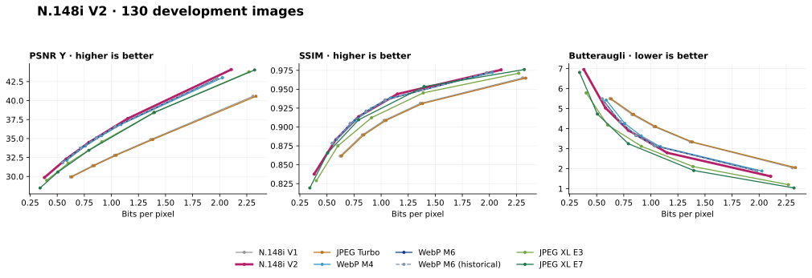

<div align="center">

# N.148i V2

### An original image codec and C library

[](src/)
[](LICENSE)
[](benchmarks/release/corpus.json)
[](benchmarks/release/library-validation/validation-summary.json)

RGB pixels → prediction → transforms → quantization → contextual entropy coding.
A complete encoder, decoder and documented binary format, implemented in C.

[Library guide](LIBRARY-NOTES.md) · [Reproduce the benchmark](BENCHMARK.md) ·
[File format](FORMAT.md) ·
[The codec series](https://micilini.com/conteudos/codecs)


<sub>Examples from the benchmark corpus. [Image attribution](docs/assets/readme/README.md).</sub>

</div>

## What V2 contains

V2 combines reconstructed-neighbor prediction, adaptive contextual rANS,
4×4/8×8/16×16 luma transforms, reconstructed-error decisions, chroma
preparation and filtering. It has a portable scalar implementation, runtime
AVX2 dispatch on supported Intel/AMD builds, and a POSIX worker pool.

The default is the measured **detail reconstruction profile**: effort 3,
4:2:0, with chroma quality equal to luma. Its production API accepts RGB
buffers in memory and returns a complete encoded buffer. The codec itself
does not link JPEG, WebP or JPEG XL.

## V1, V2 and established codecs

The release compares the **first public V1 library** and **current V2** with
JPEG Turbo, WebP M4/M6 and JPEG XL E3/E7. Both a recent WebP library and the
historical reference are included. These are **130 development images on one
Intel Core 7 150U**; the results describe this corpus and host. An unseen
validation set and another processor remain pending.

<!-- RELEASE_RESULTS_BEGIN -->
### From the first public V1 to V2

V2 achieves **13.89%–42.65% BD-rate savings** over the
original V1 across the seven quality measures on this corpus. All seven
family-adjusted intervals favor V2. These are direct V2/V1 comparisons
over shared quality ranges.

<details>
<summary>Direct V2 versus V1 results</summary>

| Metric | V2 BD-rate relative to V1 | Family 95% interval |
|---|---:|---:|
| PSNR Y | -37.74% | [-39.12, -36.31]% |
| PSNR RGB | -40.02% | [-41.53, -38.51]% |
| SSIM | -27.00% | [-29.10, -24.95]% |
| MS-SSIM | -14.07% | [-17.20, -11.03]% |
| SSIMULACRA2 | -13.89% | [-17.05, -10.94]% |
| Butteraugli | -27.32% | [-31.27, -22.83]% |
| PSNR chroma | -42.65% | [-46.44, -39.03]% |

</details>

### Compression at equivalent measured quality

**5,200 measured points · 130 images · 8 profiles · 7 metrics.**

BD-rate relative to **WebP 1.6.0 M6**. Negative means fewer bits over
the overlapping quality range; positive means more bits. These are
aggregate curves, not a promise that every image improves.

| Codec | PSNR Y | PSNR RGB | SSIM | MS-SSIM | SSIMULACRA2 | Butteraugli | Chroma |
|---|---:|---:|---:|---:|---:|---:|---:|
| N.148i V1 | +58.24% | +58.82% | +37.08% | +13.77% | +12.32% | +32.71% | +56.54% |
| **N.148i V2** | -1.59% | -5.11% | -0.79% | -2.24% | -3.17% | -3.86% | -10.10% |
| JPEG Turbo 2.1.5 | +60.27% | +61.01% | +39.32% | +15.40% | +13.91% | +34.60% | +59.05% |
| WebP 1.6.0 M4 | +1.77% | +2.43% | +1.01% | +3.61% | +4.54% | +3.49% | +4.72% |
| WebP 1.6.0 M6 | 0.00% | 0.00% | 0.00% | 0.00% | 0.00% | 0.00% | 0.00% |
| WebP 1.3.2 M6 | +0.00% | +0.00% | +0.00% | +0.00% | +0.00% | +0.00% | +0.00% |
| JPEG XL 0.12.0 E3 | +10.26% | +17.11% | +15.65% | +0.56% | -13.54% | -18.19% | +23.21% |
| JPEG XL 0.12.0 E7 | +10.74% | +14.27% | +3.41% | -5.84% | -20.18% | -22.39% | +14.75% |



### How certain are V2's differences from WebP M6?

10,000 paired image bootstrap replicates, stratified by content.
The family intervals account for the seven quality comparisons.
An interval crossing zero does not establish a gain or a loss.

| Metric | V2 BD-rate | 95% interval | Family 95% interval | Interior-point omission range | Images won / tied / lost |
|---|---:|---:|---:|---:|---:|
| PSNR Y | -1.59% | [-2.88, -0.40]% | [-3.38, +0.03]% | [-1.80, -1.58]% | 69 / 0 / 61 (130/130 valid) |
| PSNR RGB | -5.11% | [-6.55, -3.66]% | [-7.16, -3.21]% | [-5.29, -4.56]% | 100 / 0 / 30 (130/130 valid) |
| SSIM | -0.79% | [-2.24, +0.51]% | [-2.78, +0.94]% | [-1.11, +0.02]% | 66 / 0 / 64 (130/130 valid) |
| MS-SSIM | -2.24% | [-3.74, -0.89]% | [-4.30, -0.40]% | [-2.43, -1.20]% | 75 / 0 / 55 (130/130 valid) |
| SSIMULACRA2 | -3.17% | [-4.54, -1.87]% | [-5.11, -1.37]% | [-3.23, -2.35]% | 86 / 0 / 44 (130/130 valid) |
| Butteraugli | -3.86% | [-6.51, -1.30]% | [-7.42, -0.48]% | [-4.03, -2.57]% | 72 / 0 / 58 (130/130 valid) |
| PSNR chroma | -10.10% | [-12.34, -7.78]% | [-13.08, -6.90]% | [-10.75, -7.94]% | 98 / 0 / 23 (121/130 valid) |

For this development sample, the family intervals support **5/7 lower-rate
results, 0/7 higher-rate results and 2/7 inconclusive results** against
this WebP M6 configuration. Per-image wins use the point estimates;
they are not separate significance tests. Sampling intervals do not
include codec tuning bias or five-point interpolation error. The omission
range recomputes BD-rate after dropping each interior point in turn; it
is a sensitivity diagnostic, not a confidence interval. The
[full quality analysis](benchmarks/release/quality-analysis.json) records
missing overlaps and sensitivity to omitting each interior curve point.

### Speed at comparable file sizes

One logical CPU, one codec thread; 2 blocks × 7 measured repetitions.
The same **43/130 images** appear in every row below: all eight
profiles meet the medium size target and differ from WebP M6's actual
file size by at most 2% per image. This is a conditional subset.

Times are averages of per-image medians; negative time differences
mean faster than WebP 1.6.0 M6. Brackets show 95% paired intervals.

| Codec | Encode ms/image | Encode Δ [95% interval] | Decode ms/image | Decode Δ [95% interval] |
|---|---:|---:|---:|---:|
| N.148i V1 | 1.874 | -98.17% [-98.25, -98.09]% | 1.112 | -77.26% [-78.04, -76.40]% |
| **N.148i V2** | 103.766 | +1.18% [-1.55, +4.04]% | 4.565 | -6.66% [-9.51, -2.96]% |
| JPEG Turbo 2.1.5 | 2.647 | -97.42% [-97.48, -97.31]% | 1.208 | -75.29% [-75.93, -74.21]% |
| WebP 1.6.0 M4 | 38.100 | -62.85% [-64.49, -60.94]% | 4.874 | -0.34% [-0.60, -0.01]% |
| WebP 1.6.0 M6 | 102.552 | +0.00% [+0.00, +0.00]% | 4.891 | +0.00% [+0.00, +0.00]% |
| WebP 1.3.2 M6 | 106.100 | +3.46% [+3.06, +4.64]% | 5.266 | +7.67% [+7.04, +9.62]% |
| JPEG XL 0.12.0 E3 | 14.125 | -86.23% [-86.98, -85.28]% | 9.763 | +99.63% [+90.24, +110.45]% |
| JPEG XL 0.12.0 E7 | 162.148 | +58.11% [+47.93, +68.85]% | 9.812 | +100.63% [+90.12, +112.45]% |

[Common-subset details](benchmarks/release/common-size-timing.json) include
MPix/s, image identifiers, bytes and intervals adjusted for 14 comparisons.

#### V2 versus WebP M6 across operating ranges

Each row uses all eligible pairs for that target, with both target and
actual pairwise tolerances enforced. Size tolerance is 2%; SSIM tolerance
is 0.0005. These intervals account for six tests per matching mode.

| Matched by | Level | Images | Encode Δ [family 95% interval] | Decode Δ [family 95% interval] |
|---|---|---:|---:|---:|
| File size | Low | 103/130 | +5.03% [+1.54, +8.83]% | +1.72% [-2.22, +6.46]% |
| File size | Medium | 90/130 | +1.68% [-1.08, +4.68]% | -6.50% [-10.23, -2.12]% |
| File size | High | 76/130 | -1.32% [-3.87, +1.65]% | -15.81% [-19.44, -11.84]% |
| SSIM | Low | 54/130 | +21.74% [+16.60, +28.31]% | +23.15% [+17.45, +30.54]% |
| SSIM | Medium | 48/130 | +10.03% [+5.93, +14.62]% | +7.97% [+3.22, +13.60]% |
| SSIM | High | 50/130 | +2.81% [-1.36, +7.54]% | -4.98% [-10.88, +2.10]% |

Nominal-quality timings, every external reference, exclusions and raw
observations are retained in the [timing report](benchmarks/release/timing-analysis.json)
and [raw samples](benchmarks/release/timing-samples.csv). Measurements cover
this CPU only, with clock frequency managed by the operating system.
<!-- RELEASE_RESULTS_END -->

### Interpreting the speed results

For V2 versus WebP M6, the size-matched results support faster decoding at
the medium and high targets; encoding at those targets is inconclusive.
At the low size target, encoding is slower and decoding is inconclusive.
With SSIM matched, both operations are slower at the low and medium targets;
both high-target differences are inconclusive. Speed therefore depends on
the operating point, and this run does not establish an overall
encode/decode speed advantage.

Every table is backed by the [frozen protocol](benchmarks/release/protocol.json),
source/input hashes, raw measurements and executable analysis. The
[methodology](BENCHMARK.md) explains aggregation, overlap, matching tolerances,
bootstrap intervals and the limits of this development sample.

## Use the library

```sh
cmake -S . -B build -DCMAKE_BUILD_TYPE=Release -DCMAKE_INSTALL_PREFIX="$PWD/install"
cmake --build build --config Release --parallel 2
ctest --test-dir build -C Release --output-on-failure
cmake --install build --config Release
```

Consume the installed package:

```cmake
find_package(n148i 2 CONFIG REQUIRED)
add_executable(app app.c)
target_link_libraries(app PRIVATE n148i::n148i)
# Static: n148i::n148i_static
```

```c
n148i_encode_options_t options;
n148i_encode_options_init(&options);
options.quality = 60;
options.thread_count = 1;

uint8_t *encoded = NULL;
size_t encoded_size = 0;
n148i_result_t result = n148i_encode_memory(
    &rgb_image, &options, &encoded, &encoded_size);
if (result != N148I_OK) {
    /* Handle the error before using encoded. */
}
n148i_free_buffer(encoded);
```

The [complete example](examples/memory_roundtrip.c) includes RGB input,
header inspection, decoding, error handling and memory ownership. The API
supports 8-bit RGB; serialize encode/decode calls within a process. Internal
parallelism does not make concurrent public API calls safe.

| Platform | Library artifacts | Validation for this delivery |
|---|---|---|
| Linux x86-64 | `.a`, `.so`, CMake and pkg-config packages | 29 local release gates passed |
| Windows x86-64 | Static `.lib`, DLL and import library | Cross compilation and installed-consumer linking passed; native CI pending |
| macOS Intel / Apple Silicon | `.a`, universal `.dylib`, CMake package | Native builds and installed-consumer tests configured; CI execution pending |

[Platform details and API contract](LIBRARY-NOTES.md) ·
[Build workflow](.github/workflows/build-libraries.yml)

**V2** is the release name. Numeric package/ABI metadata is `2.0.0`/`2`;
the independent on-stream format identifier remains `7`. The decoder reads
all supported format revisions, including V1. The default-profile promotion
preserved compressed bytes and decoded RGB in all **650 equivalence cases**.

## Command line

```sh
mkdir -p output
./build/n148i images/example.ppm 60
```

The CLI writes `output/image.n148i` and `output/decoded.ppm`. Applications can
use the memory API without PPM files.

## Reproduction and project layout

| Path | Purpose |
|---|---|
| `include/`, `src/` | Public API, codec, CLI and validation driver |
| `examples/`, `cmake/`, `packaging/` | Consumers and portable distribution build |
| `tests/`, `tools/` | Release checks and reproducible measurement/analysis |
| `benchmarks/release/` | Frozen protocol, raw data and final evidence |
| `benchmarks/baselines/` | Authentic V1 source required to repeat the comparison |
| `images/` | Normalized inputs and source/license attribution |

[Run the full experiment](BENCHMARK.md#reproduce-independently). The release
snapshot includes the evidence required to repeat its comparisons without
retaining intermediate development logs or commit history.

N.148i remains an experimental format. Its creation is documented in the
[codec series](https://micilini.com/conteudos/codecs).

## License

Code: [MIT](LICENSE), Copyright © 2026 Micilini Roll. Benchmark image licenses
and authors are recorded separately in the corpus manifest and credits.
