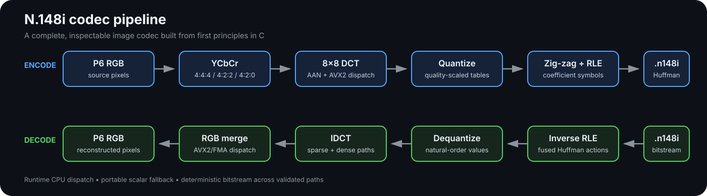
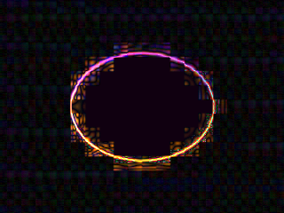
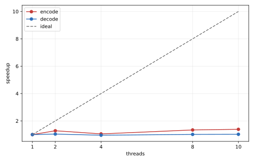

<div align="center">

# N.148i

### A handcrafted image codec, built from first principles in C

[](src/)
[](LICENSE)
[](benchmarks/v1/corpus-manifest.json)
[](benchmarks/v1/validation.log)
[](#n148i-v1-bitstream)

N.148i is an experimental lossy image codec in the same design space as
baseline JPEG: 8×8 DCT, quantization, zig-zag ordering, run-length encoding,
and canonical Huffman coding. It adds runtime AVX2/FMA dispatch, a portable
scalar path, optimized per-image Huffman tables, and a persistent pthread
worker pool.

[Read the benchmark](BENCHMARK.md) ·
[Explore the source](src/) ·
[Follow the codec series](https://micilini.com/conteudos/codecs)


<sub>Eight real inputs from the committed benchmark corpus: historical art,
landscape, architecture, texture, smooth sky, fine detail, typography, and
saturated color. [Image attribution](docs/assets/readme/README.md).</sub>

</div>

## What is N.148i?

N.148i began as a question: how much of an image codec can be understood by
building every stage instead of calling a compression library?

The answer in this repository is a complete encoder, decoder, and versioned
binary format written in plain C. Color conversion, chroma subsampling, block
transforms, quantization, entropy coding, container serialization, corruption
checks, SIMD dispatch, and threading are all visible and testable. The project
is educational and experimental; it is not a replacement for a standardized,
widely deployed format.

The complete creation journey is documented at
**[micilini.com/conteudos/codecs](https://micilini.com/conteudos/codecs)**. The
Portuguese-language series follows the codec from its first pixels and
bitstream through six optimization milestones. The Git history mirrors that
journey, so readers can inspect not just the final implementation, but how it
evolved.

## Use N.148i as a library

Version 1.0.0 packages the measured codec behind one public header,
[`include/n148i.h`](include/n148i.h). Applications pass RGB pixels in memory
and receive an allocated `.n148i` buffer, or pass a complete encoded buffer and
receive RGB pixels. PPM remains a command-line convenience and is not part of
the public API.

The **library version** identifies this implementation and follows semantic
versioning. The **format version** is the byte stored in an `.n148i` file.
Both are currently 1, but they are deliberately separate: a compatible library
fix can change 1.0.0 without changing the v1 bitstream.

### Release artifacts

| Platform | Static library | Shared library | v1 status |
|---|---|---|---|
| Linux x86-64 | `lib/static/libn148i.a` | `lib/libn148i.so.1.0.0` plus ABI symlinks | Built and tested locally |
| Windows x86-64 | `lib/static/n148i.lib` | `bin/n148i.dll` plus `lib/n148i.lib` import library | CMake/CI target; not produced locally; single-thread scalar fallback |
| macOS universal | `lib/static/libn148i.a` | `lib/libn148i.dylib` | Native CI target for Intel and Apple Silicon; not produced locally |

Packaged trees also contain `include/n148i.h`, `LICENSE`, `README.txt`,
`pkg-config` metadata where applicable, and a CMake package. Generated trees
live under `builds/` and are intentionally ignored by Git; release binaries
should come from the reproducible build or the workflow artifact.

### Complete memory roundtrip

This example creates RGB pixels, encodes them, inspects the header, decodes
them, handles every error, and releases memory with the same library that
allocated it. The source is also available as
[`examples/memory_roundtrip.c`](examples/memory_roundtrip.c).

```c
#include <stdint.h>
#include <stdio.h>
#include <stdlib.h>

#include <n148i.h>

static void report_error(const char *operation, n148i_result_t result) {
    fprintf(stderr, "%s: %s\n", operation, n148i_result_string(result));
}

int main(void) {
    enum { WIDTH = 64, HEIGHT = 48 };
    uint8_t pixels[WIDTH * HEIGHT * 3];
    for (int y = 0; y < HEIGHT; y++) {
        for (int x = 0; x < WIDTH; x++) {
            size_t offset = ((size_t)y * WIDTH + (size_t)x) * 3;
            pixels[offset + 0] = (uint8_t)(x * 255 / (WIDTH - 1));
            pixels[offset + 1] = (uint8_t)(y * 255 / (HEIGHT - 1));
            pixels[offset + 2] = (uint8_t)((x ^ y) * 4);
        }
    }

    n148i_image_t source = {pixels, WIDTH, HEIGHT, WIDTH * 3};
    n148i_encode_options_t options;
    n148i_encode_options_init(&options);
    options.quality = 75;

    uint8_t *encoded = NULL;
    size_t encoded_size = 0;
    n148i_result_t result = n148i_encode_memory(
        &source, &options, &encoded, &encoded_size);
    if (result != N148I_OK) {
        report_error("encode", result);
        return EXIT_FAILURE;
    }

    n148i_image_info_t info;
    result = n148i_read_header(encoded, encoded_size, &info);
    if (result != N148I_OK) {
        report_error("read header", result);
        n148i_free_buffer(encoded);
        return EXIT_FAILURE;
    }

    n148i_image_t decoded = {0};
    result = n148i_decode_memory(encoded, encoded_size, &decoded);
    if (result != N148I_OK) {
        report_error("decode", result);
        n148i_free_buffer(encoded);
        return EXIT_FAILURE;
    }

    printf("encoded %ux%u into %zu bytes and decoded %ux%u\n",
           info.width, info.height, encoded_size,
           decoded.width, decoded.height);

    n148i_free_image(&decoded);
    n148i_free_buffer(encoded);
    return EXIT_SUCCESS;
}
```

With an installed Linux package:

```bash
cc examples/memory_roundtrip.c $(pkg-config --cflags --libs n148i) \
  -o memory_roundtrip
./memory_roundtrip
```

Or consume the installed CMake package:

```cmake
find_package(n148i 1 CONFIG REQUIRED)
add_executable(my_app app.c)
target_link_libraries(my_app PRIVATE n148i::n148i)
```

Use `n148i::n148i_static` for the static target. On Windows, link the import
library for a shared build and copy `n148i.dll` beside the application `.exe`.
When linking `lib/static/n148i.lib` directly, define `N148I_STATIC_DEFINE`
before including the header. On macOS, keep the `.dylib` in an application
bundle or provide an appropriate `@rpath`; on Linux, install the `.so` in the
loader path or set an application-relative rpath.

### Encoding options

Always call `n148i_encode_options_init()` before changing fields. Its
`struct_size` field lets a later compatible library append options safely.

| Field | Default | Meaning |
|---|---:|---|
| `quality` | `50` | Quantization quality from 1 through 100 |
| `chroma` | `N148I_CHROMA_420` | `444`, `422`, or `420` subsampling enum |
| `optimize_huffman` | `1` | Store canonical tables optimized for this image |
| `thread_count` | `0` | Keep the process-wide automatic setting; 1 through 32 sets it explicitly |

`n148i_image_t` describes interleaved 8-bit RGB with width, height, and byte
stride. A zero stride means tightly packed `width * 3`; larger strides are
accepted, so subimages and padded rows do not need repacking by the caller.

### API reference

| Function | Parameters | Result |
|---|---|---|
| `n148i_encode_options_init` | writable options pointer | Initializes all current defaults; no return value |
| `n148i_encode_memory` | source image, optional options, output buffer pointer, output size pointer | Allocates a complete v1 stream and returns `n148i_result_t` |
| `n148i_decode_memory` | encoded bytes and size, output image pointer | Allocates tightly packed RGB pixels and returns `n148i_result_t` |
| `n148i_read_header` | encoded bytes and size, output info pointer | Validates the container and reports dimensions, format, settings, and payload sizes without decoding pixels |
| `n148i_free_buffer` | pointer returned by the encoder | Releases an encoded buffer in the library's allocator |
| `n148i_free_image` | image returned by the decoder | Releases pixels and clears every image field |
| `n148i_result_string` | an error enum value | Returns a static English description |
| `n148i_library_version` | none | Returns the loaded library version string, currently `1.0.0` |
| `n148i_format_version` | none | Returns the supported file-format version, currently `1` |
| `n148i_simd_level` | none | Returns the active runtime dispatch level |
| `n148i_simd_name` | SIMD enum value | Returns a static name for that level |
| `n148i_simd_force` | automatic, scalar, SSE2, AVX2, or AVX2+FMA | Selects a supported path or returns an error |

The compile-time `N148I_VERSION_MAJOR`, `N148I_VERSION_MINOR`, and
`N148I_VERSION_PATCH` macros describe the header used to compile an
application. `n148i_library_version()` describes the binary actually loaded.

### Error codes

| Code | Meaning |
|---|---|
| `N148I_OK` | Operation completed |
| `N148I_ERROR_INVALID_ARGUMENT` | Null pointer, invalid option, dimensions, or stride |
| `N148I_ERROR_OUT_OF_MEMORY` | A library allocation failed |
| `N148I_ERROR_INVALID_FORMAT` | Signature or fixed header fields are invalid |
| `N148I_ERROR_UNSUPPORTED_VERSION` | The stream uses another format version |
| `N148I_ERROR_TRUNCATED_DATA` | Header, table, or payload bytes are missing |
| `N148I_ERROR_CORRUPT_DATA` | Tables, trailing bytes, or consumed size are inconsistent |
| `N148I_ERROR_SIZE_OVERFLOW` | Dimensions or encoded size exceed an internal limit |
| `N148I_ERROR_ENCODE_FAILED` | The v1 encoder could not complete |
| `N148I_ERROR_DECODE_FAILED` | The v1 entropy or reconstruction path could not complete |
| `N148I_ERROR_UNSUPPORTED_SIMD` | A forced SIMD path is unavailable on this CPU/build |

### Thread safety

Version strings, error strings, header inspection, and the two free functions
can be called concurrently. The v1 codec retains process-wide SIMD dispatch,
thread-count state, encoder histogram scratch space, and one pthread pool, so
`n148i_encode_memory()` and `n148i_decode_memory()` must not overlap another
encode/decode call unless the application supplies external synchronization.
Call `n148i_simd_force()` and set a nonzero encoding `thread_count` before
starting worker threads, never while a codec call is active. All returned
buffers are independently owned after a call completes.

## Build the library

CMake 3.16 or newer is the portable distribution build. Static code is copied
into an application at link time; it is simple to deploy but increases each
executable and requires relinking for updates. A shared library stays in a
separate `.so`, `.dylib`, or `.dll`; several programs can load it and it can be
updated independently as long as the ABI remains compatible.

### Linux

```bash
sudo apt install -y build-essential cmake
cmake -S . -B cmake-build-linux \
  -DCMAKE_BUILD_TYPE=Release \
  -DCMAKE_INSTALL_PREFIX="$PWD/builds/linux-x86_64"
cmake --build cmake-build-linux --parallel
ctest --test-dir cmake-build-linux --output-on-failure
cmake --install cmake-build-linux
```

This creates versioned `libn148i.so` links, `libn148i.a`, the public header,
and discovery metadata. The shared object is built with hidden visibility and
an ELF version script, so its dynamic ABI contains only `n148i_*` symbols.

### Windows with Visual Studio

Run these commands from a Developer PowerShell:

```powershell
cmake -S . -B cmake-build-windows -G "Visual Studio 17 2022" -A x64 `
  -DCMAKE_INSTALL_PREFIX="$PWD/builds/windows-x86_64"
cmake --build cmake-build-windows --config Release --parallel
ctest --test-dir cmake-build-windows -C Release --output-on-failure
cmake --install cmake-build-windows --config Release
```

The `.dll` is the loadable library; it is not an executable. MSVC links against
its import `.lib`, while the separate static `.lib` contains the codec itself.
The v1 Windows build intentionally defines `N148_NO_THREADS`: it is functional
but single-threaded because the existing worker pool uses pthreads.

### Cross-compile Windows from Linux

```bash
sudo apt install -y mingw-w64
cmake -S . -B cmake-build-mingw \
  -DCMAKE_TOOLCHAIN_FILE=cmake/toolchains/mingw-w64-x86_64.cmake \
  -DCMAKE_BUILD_TYPE=Release \
  -DCMAKE_INSTALL_PREFIX="$PWD/builds/windows-x86_64"
cmake --build cmake-build-mingw --parallel
cmake --install cmake-build-mingw
```

Cross-compilation verifies that the files link, but running the Windows tests
still requires Windows or Wine. MinGW-w64 was not installed on the Linux
machine used for this change, and passwordless package installation was not
available, so no local Windows binary is claimed.

### macOS universal build

Run this on a Mac with Xcode command-line tools:

```bash
cmake -S . -B cmake-build-macos \
  -DCMAKE_BUILD_TYPE=Release \
  -DCMAKE_OSX_DEPLOYMENT_TARGET=10.15 \
  -DCMAKE_OSX_ARCHITECTURES="x86_64;arm64" \
  -DCMAKE_INSTALL_PREFIX="$PWD/builds/macos-universal"
cmake --build cmake-build-macos --parallel
ctest --test-dir cmake-build-macos --output-on-failure
cmake --install cmake-build-macos
```

Apple's SDK license prevents a genuine macOS build from this Linux machine.
The checked-in [GitHub Actions workflow](.github/workflows/build-libraries.yml)
runs the native Linux, Windows, and macOS builds and uploads each installed
tree as an artifact.

The existing Makefile remains the fast Linux development path. `make` builds
the CLI against `libn148i.a`, while `make libraries` creates both local library
forms.

## How it works



The encoder stores all Y blocks first, followed by Cb and Cr, with an
independent DC predictor for each plane. Entropy writing and predictor chains
remain ordered; independent color, transform, histogram, and reconstruction
work can run in parallel. At runtime, CPUID and operating-system AVX-state
checks select the best supported path without making the binary unportable.

Key implementation properties:

- binary P6 PPM input and output, RGB24, with no external image wrapper;
- selectable 4:4:4, 4:2:2, and 4:2:0 chroma;
- scalar and AVX2 AAN forward/inverse DCT implementations;
- AVX2/FMA color conversion and vectorized chroma processing;
- sparse and dense inverse reconstruction paths;
- per-image optimized canonical Huffman tables;
- complete v1 container validation before entropy decoding;
- deterministic compressed bytes across validated scalar, AVX2, and worker
  counts;
- threaded and `NOTHREADS=1` builds from the same source tree.

## A real round trip

This example uses the repository's 320×240 fixture, quality 50, optimized
Huffman tables, and 4:2:0 chroma.

| Original | N.148i reconstruction | Absolute RGB error, amplified 8× |
|:---:|:---:|:---:|
|  |  |  |
| 230,415-byte PPM | 2,290-byte `.n148i` | Visualization only |

The result is a **100.6:1 compression ratio relative to the uncompressed PPM**,
and the reconstruction measures **34.70 dB PSNR**. PPM is intentionally used
as the uncompressed interchange format; this ratio is not a comparison against
PNG or another compressed source.

## Benchmark results

The final benchmark uses 120 redistributable images, five operating points per
codec, direct in-process C APIs, disk I/O outside timed regions, CPU affinity,
warm-up removal, interleaved codec order, and per-image paired statistics.
N.148i and libjpeg-turbo use 4:2:0 plus optimized Huffman coding. JPEG XL 0.12.0
is tested at effort 3 and effort 7.

These are the measured results on an Intel Core 7 150U. They are not marketing
estimates. The complete environment, methodology, uncertainty, per-image
results, and limitations are in **[BENCHMARK.md](BENCHMARK.md)**. To reproduce
the complete measurement from corpus verification through analysis, follow
[`tools/README.md`](tools/README.md).

### Compression efficiency at equal quality

BD-rate integrates each codec's rate–distortion curve over its common quality
range. Negative values mean N.148i needs fewer bits; positive values mean it
needs more.

| Quality metric | vs libjpeg-turbo | vs JPEG XL e3 | vs JPEG XL e7 |
|---|---:|---:|---:|
| PSNR RGB | **-1.38%** | +34.59% | +38.59% |
| PSNR Y | **-1.33%** | +41.96% | +40.98% |
| SSIM | **-1.60%** | +17.80% | +31.72% |
| MS-SSIM | **-1.40%** | +12.87% | +20.70% |
| SSIMULACRA2 | **-1.39%** | +30.18% | +41.52% |
| Butteraugli | **-1.35%** | +64.08% | +71.88% |

The honest reading is straightforward: **N.148i is slightly more compact than
libjpeg-turbo over this range, while JPEG XL is substantially more compact than
N.148i.** Butteraugli also finds nine individual images where JPEG beats
N.148i, despite N.148i winning the aggregate.

| PSNR RGB rate–distortion | SSIMULACRA2 rate–distortion |
|:---:|:---:|
|  |  |

### Single-thread speed

The table reports the geometric mean of paired N.148i/competitor timing ratios
over all 120 images and five mapped operating points.

| Competitor | N.148i encode result | N.148i decode result | Images won/tied/lost |
|---|---:|---:|---:|
| libjpeg-turbo | **25.84% less time** (1.349× throughput) | **6.70% less time** (1.072× throughput) | 120/0/0 encode, 118/2/0 decode |
| JPEG XL effort 3 | **7.34× faster** | **10.79× faster** | 120/0/0 in both |
| JPEG XL effort 7 | **89.29× faster** | **9.97× faster** | 120/0/0 in both |

JPEG and N.148i produce nearly identical quality at each shared nominal point.
JPEG XL uses a documented distance mapping that spans the same quality range,
but its five points are not exact quality matches; the JXL speed multipliers
must therefore not be read as interpolated timings at one exact PSNR.

### Thread scaling

N.148i's multicore result is its clearest weakness. At quality 60, 10 threads
reach only **1.386× encode speedup** and **1.022× decode speedup**. The best
decode result is 1.038× at two threads.



The single-thread timing target was met by 99.33% of measured series. The
multi-thread axis retained 3.04% median residual timing uncertainty and is
reported as indicative rather than definitive. This limitation is preserved
in the data and discussed in the full report.

### Do the metrics agree?

Not always. Against JPEG, 18 of 120 images contain a metric-level inversion.
Against each JPEG XL effort, 13 images do. The strongest example is
`corpus-0107.ppm`: PSNR RGB and SSIM favor N.148i against JXL effort 3, while
SSIMULACRA2 and Butteraugli strongly favor JPEG XL. The repository reports the
disagreement instead of selecting the metric that makes one codec look best.

## The complete test corpus is in this repository

Unlike the earlier lightweight layout, this branch intentionally commits all
120 binary P6 files under [`images/`](images/), together with the raw benchmark
outputs. That makes the experiment inspectable without trusting a summary.

| Corpus property | Value |
|---|---:|
| Images | 120 |
| Categories | 8, with 15 images each |
| Total pixels | 53,780,086 |
| Resolution range | 129,024 to 1,324,800 pixels |
| Public domain / CC0 | 33 |
| CC BY 2.0 | 87 |
| PPM data on disk | approximately 155 MiB |

The eight categories cover historical portrait artwork, natural landscapes,
urban architecture, high-frequency textures, smooth gradients, fine detail,
sharp text/edges, and saturated/desaturated colors. No entry contains an
identifiable photographed person.

Every file has a source URL, author, license, dimensions, source hash, and
normalized PPM hash in
[`benchmarks/v1/corpus-manifest.json`](benchmarks/v1/corpus-manifest.json).
Human-readable attribution is in [`images/CREDITS.txt`](images/CREDITS.txt).
All PPMs are committed directly, so no separate corpus archive is required.

To validate the files already present:

```bash
python3 tools/fetch_corpus.py
```

To redownload and reconstruct every PPM from its recorded origin:

```bash
python3 tools/fetch_corpus.py --force
```

The command exits with an error if a source is unavailable, has changed, or
does not reproduce the expected hash. ImageMagick 6.9.12-98 produced the
committed normalization; another version is allowed to try, but the final hash
remains authoritative.

## Quick start

### Core codec

The core N.148i executable, timing driver, and validator have no codec-library
dependency.

```bash
sudo apt update
sudo apt install -y build-essential

make
./n148i images/example.ppm 50 2
```

Arguments are `input`, `quality` from 1 to 100, and chroma mode:

| Value | Chroma mode |
|---:|---|
| `0` | 4:4:4 |
| `1` | 4:2:2 |
| `2` | 4:2:0 |

Any committed corpus image can be used directly:

```bash
./n148i images/corpus-0073.ppm 60 2
```

The command writes `output/image.n148i` and `output/decoded.ppm`.

### Correctness suite

```bash
make validate
./validate

# Also verify the portable build without pthread workers.
make clean
make NOTHREADS=1 validate
./validate
```

The suite checks scalar/AVX2 byte identity, odd dimensions, all chroma modes,
one versus four workers, bitstream round trips, and exact payload consumption.
The recorded final run is in
[`benchmarks/v1/validation.log`](benchmarks/v1/validation.log).

### libjpeg-turbo comparison

```bash
sudo apt install -y libjpeg-turbo8-dev pkg-config
make compare
./compare images/example.ppm 50 20
```

`compare` links libjpeg directly and keeps input I/O outside the repeated codec
measurements. It uses 4:2:0 and optimized Huffman tables for both codecs.

### JPEG XL benchmark and analysis

Install the analysis dependencies:

```bash
sudo apt install -y python3-venv imagemagick libjxl-dev libjxl-tools
python3 -m venv .venv
. .venv/bin/activate
python -m pip install numpy scipy scikit-image Pillow sewar matplotlib
```

The final run requires libjxl 0.8 or newer and was produced with 0.12.0. If the
distribution package meets that requirement, build the direct C driver with:

```bash
make benchmark-final
```

If the package is older, build the official libjxl release as documented in
[BENCHMARK.md](BENCHMARK.md#1-environment), then point the build at that prefix:

```bash
make benchmark-final JXL_PREFIX=/path/to/libjxl/install
```

Run the complete matrix and regenerate every analysis table and plot:

```bash
python tools/benchmark_final.py \
  --reps 15 --max-reps 255 --parallel-max-reps 31 \
  --warmups 3 --sample-ms 20 --noise-target-pct 1

python tools/analyze_final_benchmark.py
python tools/collect_benchmark_environment.py
```

The metric executables `ssimulacra2` and `butteraugli_main` must be available
from the libjxl build. Their paths can be supplied through the corresponding
command-line options; run each tool with `--help` for the complete interface.

## Build targets

| Command | Purpose | Extra dependency |
|---|---|---|
| `make` | Build the N.148i encode/decode CLI | none |
| `make libraries` | Build `libn148i.a` and versioned `libn148i.so` | none |
| `make bench` | Build the focused N.148i timing driver | none |
| `make validate` | Build correctness and determinism tests | none |
| `make compare` | Build the in-process JPEG comparison | libjpeg-turbo |
| `make benchmark-final JXL_PREFIX=...` | Build N.148i/JPEG/JXL benchmark | libjpeg-turbo + libjxl |
| `make NOTHREADS=1` | Build the inline, threadless codec | none |
| `make clean` | Remove compiled executables | none |

The default build uses `-O2` and baseline architecture flags. SIMD functions
carry their own targets and are selected at runtime.

## N.148i v1 bitstream

The decoder starts with a 21-byte little-endian header:

| Offset | Size | Field | Reference value |
|---:|---:|---|---:|
| `0` | 5 | Signature | `N148I` |
| `5` | 1 | Version | `1` |
| `6` | 4 | Width | `320` |
| `10` | 4 | Height | `240` |
| `14` | 1 | Quality | `50` |
| `15` | 1 | Chroma | `2` |
| `16` | 1 | Optimized-table flag | `1` |
| `17` | 4 | Entropy payload size | `2145` |

Reference header at quality 50:

```text
4e 31 34 38 49 01 40 01 00 00 f0 00 00 00 32 02 01 61 08 00 00
```

Four serialized canonical Huffman specifications follow when the optimized
flag is set. The decoder rejects bad signatures, unsupported versions,
impossible dimensions and modes, malformed/oversubscribed tables, truncated
payloads, and payloads whose consumed byte count differs from the header.

## Repository map

```text
n148/
├── include/n148i.h            sole public library header
├── src/                       codec internals and command-line programs
├── examples/                  compilable installed-library consumer
├── cmake/                     package templates and cross toolchain
├── tools/                     benchmark tools and reproduction guide
├── images/
│   ├── example.ppm            official lesson fixture
│   ├── corpus-0001.ppm ...    120 committed benchmark inputs
│   ├── CREDITS.txt            human-readable attribution
│   └── MANIFEST.json          corpus manifest mirror
├── benchmarks/
│   └── v1/
│       ├── final-results.csv      5,400 unrounded summary rows
│       ├── timing-samples.csv     197,440 individual samples
│       ├── corpus-manifest.json   licenses, origins, and hashes
│       ├── environment.json       captured machine and toolchain
│       └── analysis/              BD-rate, statistics, and SVG plots
├── builds/                    ignored local/release artifacts
├── .github/workflows/         native three-platform library build
├── docs/assets/readme/        README visuals and attribution
├── BENCHMARK.md                complete scientific report
├── CMakeLists.txt
├── Makefile
└── LICENSE
```

## Known limitations

- N.148i is a custom experimental format with no external decoder ecosystem.
- Public encode/decode calls require external serialization in v1 because
  dispatch, thread settings, histogram scratch space, and the pool are global.
- Windows v1 uses the scalar, single-thread fallback; POSIX builds retain SIMD
  dispatch and pthread workers where supported.
- Entropy order and DC prediction constrain multicore scaling.
- The benchmark covers one mobile x86-64 CPU and mostly JPEG-origin source
  material, spatially resampled before testing.
- The corpus tops out at 1.325 megapixels and does not cover HDR, alpha,
  animation, lossless coding, metadata, or progressive transmission.
- The multi-thread timing axis did not reach the target uncertainty on this
  machine.
- VMAF was unavailable; PSNR RGB/Y, SSIM, MS-SSIM, SSIMULACRA2, and
  Butteraugli were obtained.

These are measurement boundaries, not footnotes to hide. See
[the full limitations section](BENCHMARK.md#10-limitations) before quoting
the benchmark.

## Contributing

Issues and pull requests are welcome. Please keep codec changes focused,
preserve the bitstream contract unless a version change is intentional, and
run `make validate && ./validate` before submitting a change. Changes that
affect compressed bytes should include an explanation and updated fixtures.

## License and image attribution

N.148/N.148i source code and original project documentation are released under
the [MIT License](LICENSE), Copyright (c) 2026 Micilini Roll.

The benchmark photographs and artworks are **not relicensed as MIT** merely by
being stored here. Each remains public domain, CC0, or CC BY according to its
entry in [`images/CREDITS.txt`](images/CREDITS.txt) and
[`benchmarks/v1/corpus-manifest.json`](benchmarks/v1/corpus-manifest.json). Those
attribution files must travel with any redistributed corpus copy. README asset
provenance is documented separately in
[`docs/assets/readme/README.md`](docs/assets/readme/README.md).
